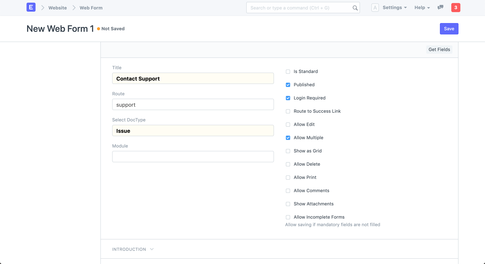
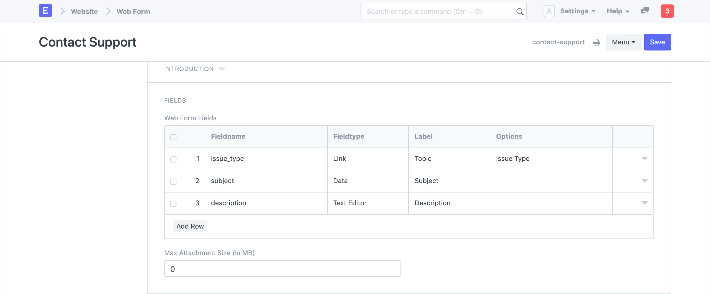
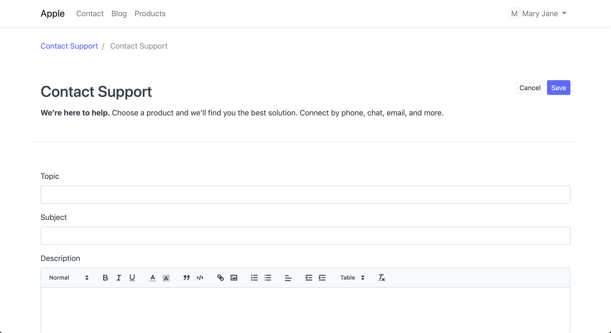
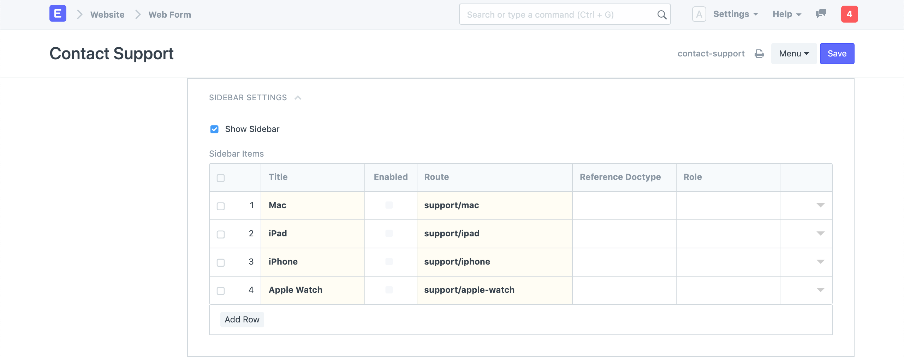
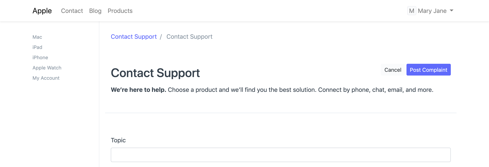
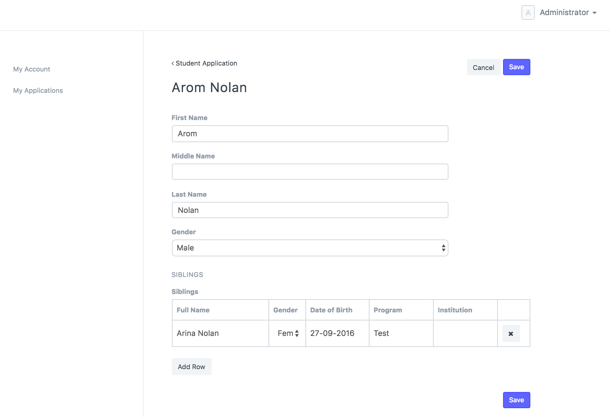
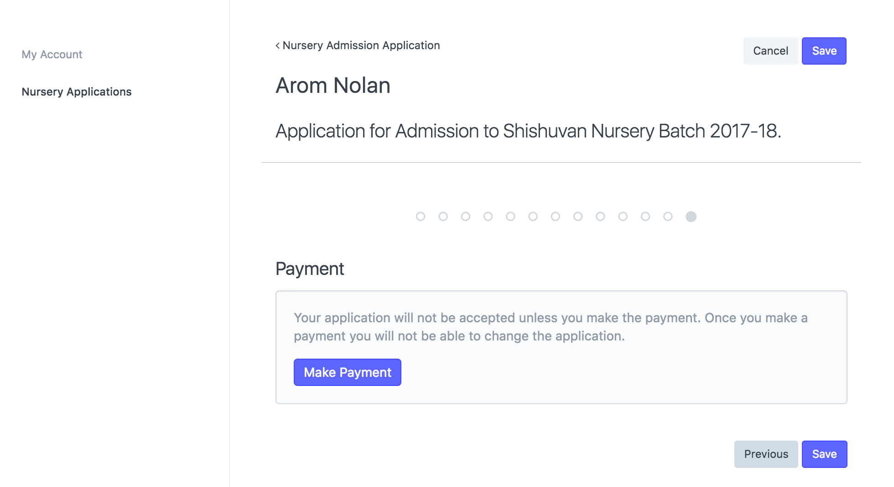
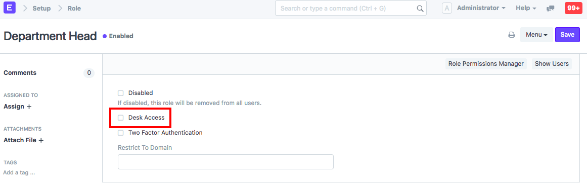
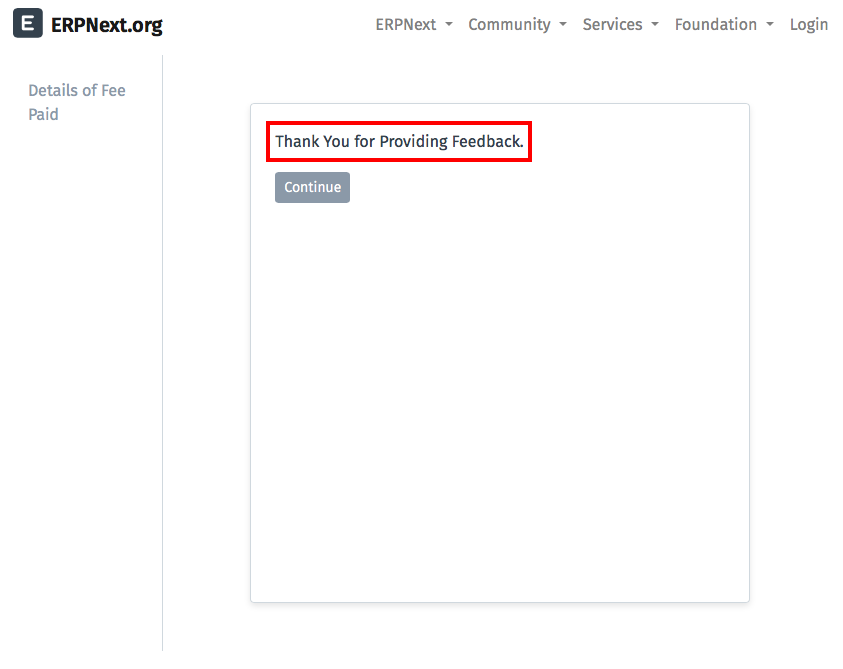

# Web Forms

[ Edit ](https://docs.frappe.io/wiki/spaces/24hrpr6es9/page/0s8vnj4qb1)

Open in ChatGPT  Ask ChatGPT about this page Open in Claude  Ask Claude about this page

# Web Forms

[ Edit ](https://docs.frappe.io/wiki/spaces/24hrpr6es9/page/0s8vnj4qb1)

Open in ChatGPT  Ask ChatGPT about this page Open in Claude  Ask Claude about this page

Stakeholders who are not part of your organization may need to interact with your ERPNext instance. You can authorize customers, suppliers, job applicants, students, and guardians to access certain information or even create certain transactions. For example, you can let anyone create an account on your website (created with ERPNext) and apply for a job. You can let your customers see the details of the complaints they have registered. These can be done using Web Forms.

> There are two types of in-built interfaces available in ERPNext. The > _Desk View_ and the _Web View_. Desk is for users who regularly interact > with ERPNext instance, like employees of your organization.

> Web View is for users who need to interact with an ERPNext instance occasionally. > Web forms are similar to the forms you generally fill in various websites on the > internet. Webforms are part of the _Web View_ interface in ERPNext.

To create a new **Web Form** go to:

> Home > Website > Web Site > Web Form

 _New Web Form_

Select the **DocType** based on which you want to build your Web Form. The **Route** will be set based on the **Title** of your Web Form. You can also add an Introduction text to show a friendly message above your form.

Add fields to your Web Form. These are the fields from the DocType you have selected. You can change the Label for these fields. Try to keep number of fields to be minimum as long forms are cumbersome to fill.

 _Web Form Fields_

Click on **See on Website** in the sidebar to view your Web form.  _Web Form_

Here is an explanation of each of the checkboxes on the right.

  1. **Published** : Web Form will be accessible only if this is enabled.

  2. **Login Required** : User can fill the Web Form only if they are logged in. When Login Required is checked,

  3. **Route to Success Link** : Go to Success Link after the form is submitted.

  4. **Allow Edit** : If this is unchecked the form becomes read-only once it is saved.

  5. **Allow Multiple** : Allow user to create more than one record.

  6. **Show as Grid** : Show records in a table format.

  7. **Allow Delete** : Allow user to delete the records that he/she has created.

  8. **Allow Comments** : Allow user to add comments on the created form.

  9. **Allow Print** : Allow user to print the document in the selected Print Format.

  10. **Allow Incomplete Forms** : Allow user to submit form with partial data.

  11. Features

* * *

### 2.1 Sidebar

You can also show contextual links in a sidebar on your Web Form. Set it up in **Sidebar Settings**.

 _Web Form Sidebar_

 _Web Form with Sidebar_

### 2.2 Creating Web Forms with Child Table

You can add child tables to your web forms, just like regular forms.

### 2.3 Payment Gateway Integration

You can now add a Payment Gateway to the web form, so that you can ask users to pay against a web form. A good example for this is a conference ticket.

### 2.4 Portal User

We have also introduced roles for Website users. Before version 11, if you assigned any 'Role' to a user he would get access to 'Desk View'. From version 11 you can assign a 'Role' but still disallow access to 'Desk View' by unchecking 'Desk Access' in Role.

In Portal Settings, you can set a role against each menu item so that only users with that role will be allowed to see that item.

### 2.5 Custom Script

You can write custom scripts for your Web Form for things like validating your inputs, auto-filling values, showing a success message, or any arbitrary action.

To learn how to write custom scripts for your Web Forms, read [Custom Scripts documentation](https://frappeframework.com/docs/user/en/desk/scripting/client-script).

### 2.6 Custom CSS

You can customize the look and feel of your Web Form by writing your own Custom CSS. Inspect the elements on the page to see what classes are available for styling. Learn more about CSS [here](https://developer.mozilla.org/en-US/docs/Learn/Getting_started_with_the_web/CSS_basics).

### 2.7 Actions

You can add the text in 'Success Message' field and this text will be shown to user once he successfully submits the web form . And the user is redirected to the URL given at 'Success URL' when clicked on 'Continue' button. This is only applicable to webforms accessible without the user login(webforms with 'Login Required' checkbox unchecked).

### 2.8 Result

When a website user submits the form, the data will be stored in the document/doctype for which web form is created.

### 2.9 Customizing

For customizing web forms, see the [Frappe Web Forms Documentation](https://frappeframework.com/docs/user/en/web-form)

[ Previous Page Web Page Builder  ](../../../web-page-builder.md) [ Next Page Website Route Meta  ](https://docs.frappe.io/erpnext/website-route-meta)

Last updated 2 weeks ago 

Was this helpful?
