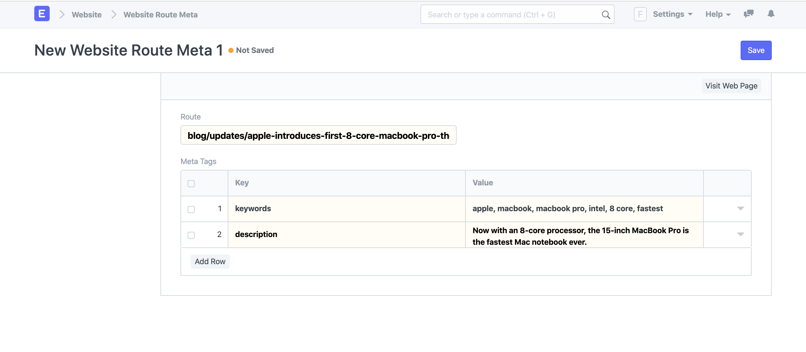

# Website Route Meta

[ Edit ](https://docs.frappe.io/wiki/spaces/24hrpr6es9/page/0s8g9snlm7)

Open in ChatGPT  Ask ChatGPT about this page Open in Claude  Ask Claude about this page

# Website Route Meta 

[ Edit ](https://docs.frappe.io/wiki/spaces/24hrpr6es9/page/0s8g9snlm7)

Open in ChatGPT  Ask ChatGPT about this page Open in Claude  Ask Claude about this page

**Arbitrary meta tags can be added in your web pages using Website Route Meta.**

Meta Tags are invisible tags that provide data about your page to search engines and website visitors. When used correctly, these tags may help boost your SEO and rankings on popular search engines. These tags will be placed in the `` section of your page. ERPNext allows you add arbitrary meta tags in your web pages to improve the SEO of your pages.

To access Website Route Meta go to:

> Home > Website > Web Site > Website Route Meta

## 1\. How to add meta tags to a web page

  1. Go to the Website Route Meta list and click on New.
  2. Enter the route. Make sure the route doesn't start with a slash (`/`). A Web Page for this route should exist.
  3. Add key value pairs for each meta tag. For e.g., to add keywords to your web page, enter "keywords" as the Key and add comma separated keywords in the Value column.
  4. Click on Save.

 _New Website Route Meta_

Now if you check the page source of your web page, the meta tags will look something like this:
[code] 
    
    
[/code]

> **Note:** Meta Tags are not only limited to Web Page, but they can be added to any route that has a website page in ERPNext.
> 
> For e.g., You can add meta tags to your blog posts if you know the route which you can get from the Blog Post form.

[ Previous Page Web Forms ](../../../web-form.md) [ Next Page Blogs ](https://docs.frappe.io/erpnext/blogs)

Last updated 2 weeks ago 

Was this helpful?
