# Website Settings

[ Edit ](https://docs.frappe.io/wiki/spaces/24hrpr6es9/page/0s8bag7g45)

Open in ChatGPT  Ask ChatGPT about this page Open in Claude  Ask Claude about this page

# Website Settings 

[ Edit ](https://docs.frappe.io/wiki/spaces/24hrpr6es9/page/0s8bag7g45)

Open in ChatGPT  Ask ChatGPT about this page Open in Claude  Ask Claude about this page

Website related settings like landing page and website wide theme can be configured here.

To access Website Settings, go to:

> Home > Website > Setup > Website Settings

## 1\. Landing Page

Configure the default landing page of your website by setting the **Home Page** field to the route of that page. You can put any route here including standard routes like `home`, `about`, `contact`, `login`, `all-products`, and `blog`.

You can also set a [Web Page](web-page.md) as the landing page.

If you want to use the ERPNext [Homepage](homepage.md), you must set it as `home`.

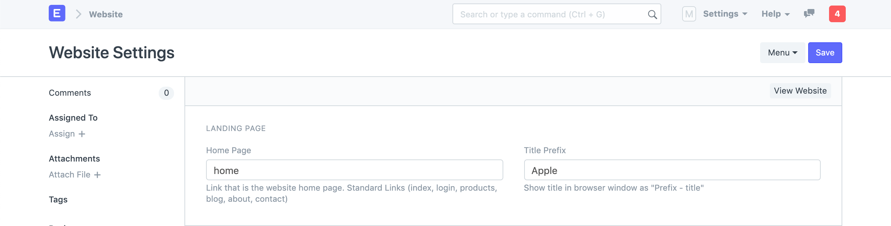 _Website Settings - Landing Page_

You can also set the **Title Prefix** here. It will be appended to the browser title on every page. You can put your company name here.

## 2\. Website Theme

Create a personalized theme for your Website and set it here. Learn more about configuring Website Theme [here](website-theme.md).

## 3\. Brand

### 3.1 Brand Logo

You can set the brand logo for your website in this section. Upload the Brand Image first and then click on "Set Banner from Image" button. It will generate a Banner HTML with your uploaded logo.

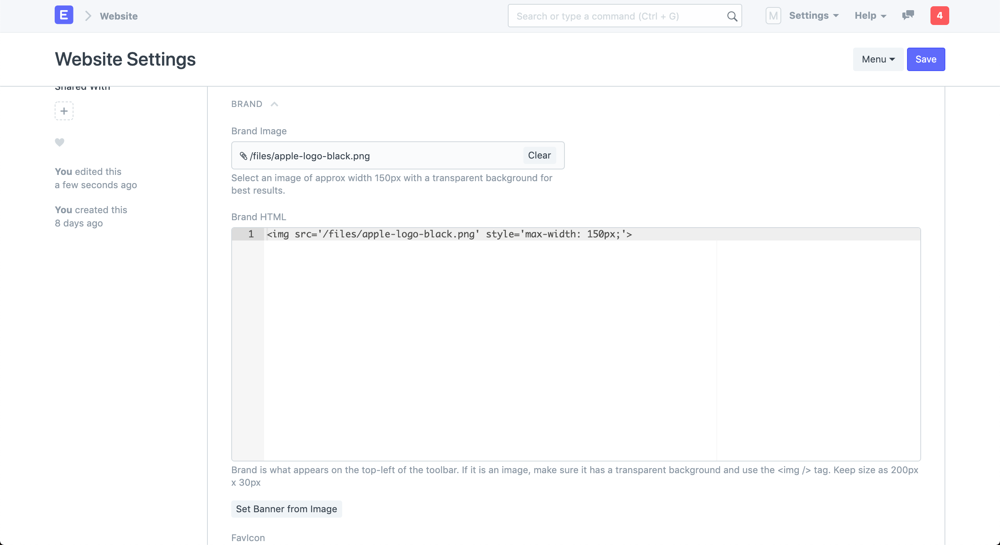 _Website Settings - Banner Image_

### 3.2 Favicon

You can also set the favicon of your website in this section. It appears on the left side of the browser tab.

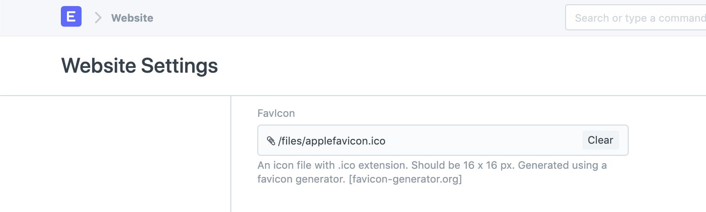 _Website Settings - Favicon_

View your website by clicking on **View Website** in the action bar on top right.

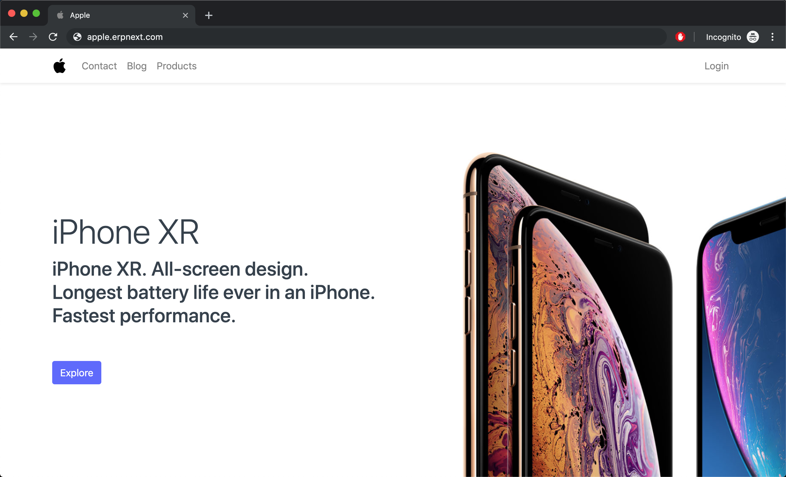 _Website with Brand and Favicon_

## 4\. Top Bar

You can customize the menu items in the navbar of your website from the **Top Bar** section.

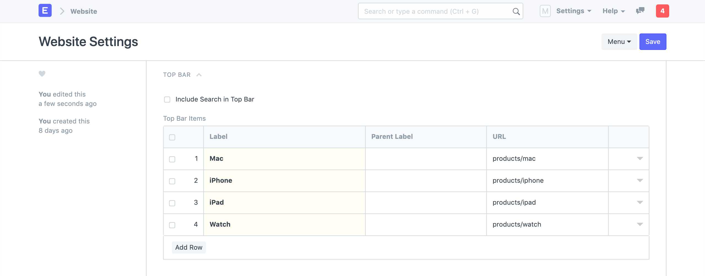 _Website Setting - Top Bar_

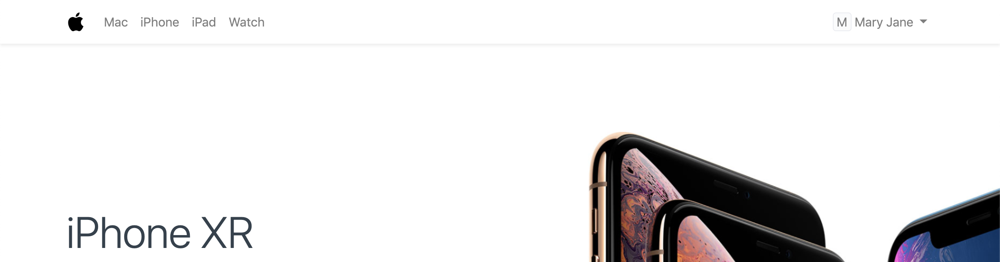 _Website Navbar Items_

## 5\. Banner

You can add a persistent banner to your website which will be shown above the navbar on all web pages. You can write any valid Bootstrap 4 markup here.

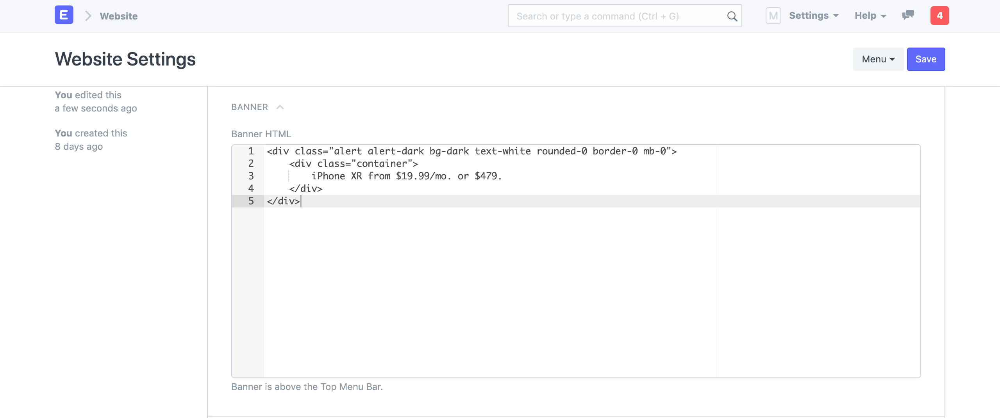 _Website Settings - Banner_

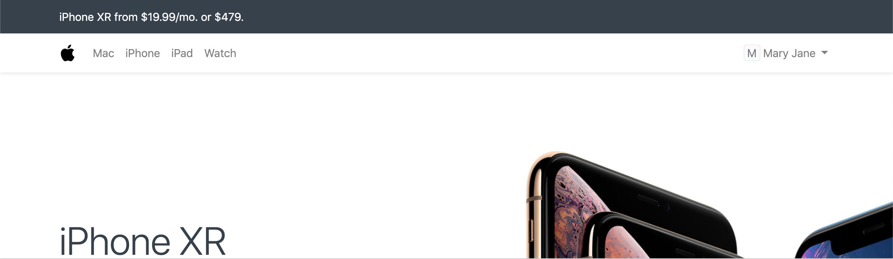 _Website Banner_

## 6\. Footer

You can add address information and categorized links to your footer in the **Footer** section.

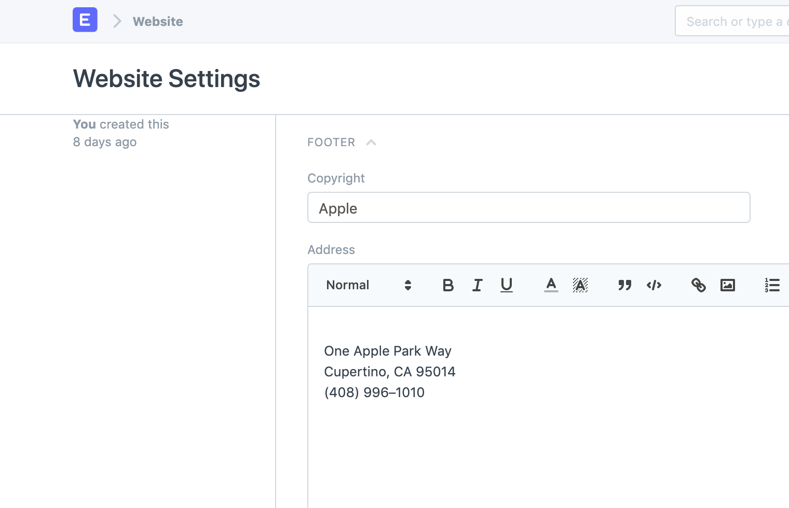 _Website Settings - Footer Address_

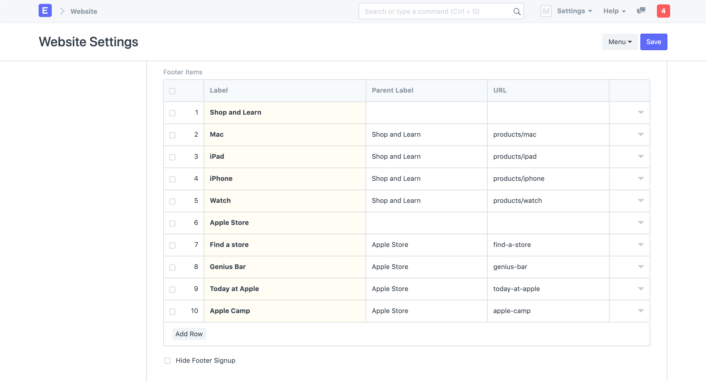 _Website Settings - Footer Links_

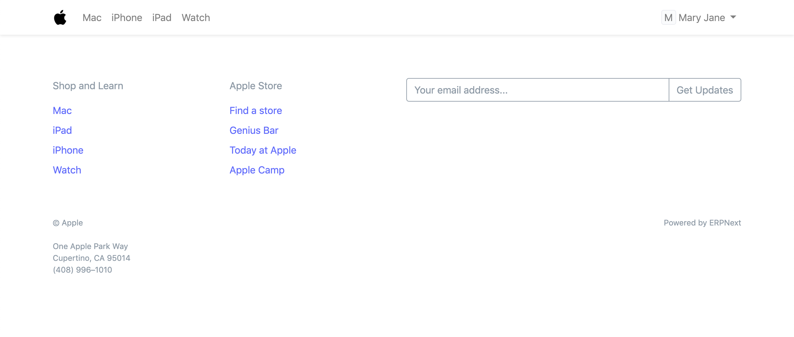 _Website Footer_

#### Configuring "Powered by" Section

You can configure Powered by section by editing "Footer Powered By"

## 7\. Google Integrations

### 7.1 Google Indexing

#### How to set up automated Google Indexing

In order to allow ERPNext to request Google crawlers to index a web page, you need to authorize ERPNext to send a request whenever the user requests the data. Google Drive Integration is set up with the following steps:

  * Create OAuth 2.0 Credentials via [Google Settings](google_settings.md)

  * Enable indexing in the Website Settings

  * Now click on **Authorize API Indexing Access** to authorize ERPNext to send a publish request.

  * Once Authorized, an indexing request is automatically sent on creation/update/trash of any new blog post or web pages created via the user.

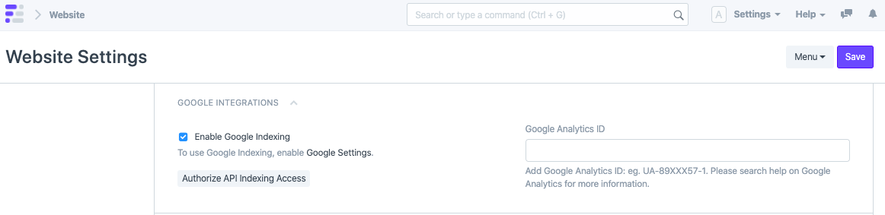 _Google Integrations_

### 7.2 Google Analytics

You can enable Google Analytics on your website. Just get your [Google Analytics ID](https://support.google.com/analytics/answer/1008080?hl=en) from your Google Console and set it here.

By default, Google Analytics will collect the full IP address of your website visitors. By checking "Google Analytics Anonymize IP", ERPNext will instruct Google Analytics to anonymize the IP address before it is sent to Google servers. You can find out more about the effect of this setting in [Google's documentation](https://support.google.com/analytics/answer/2763052).

## 8\. HTML Header

You can use this section to set meta tags across all of your web pages. A common use case is to add Google site verification tags.

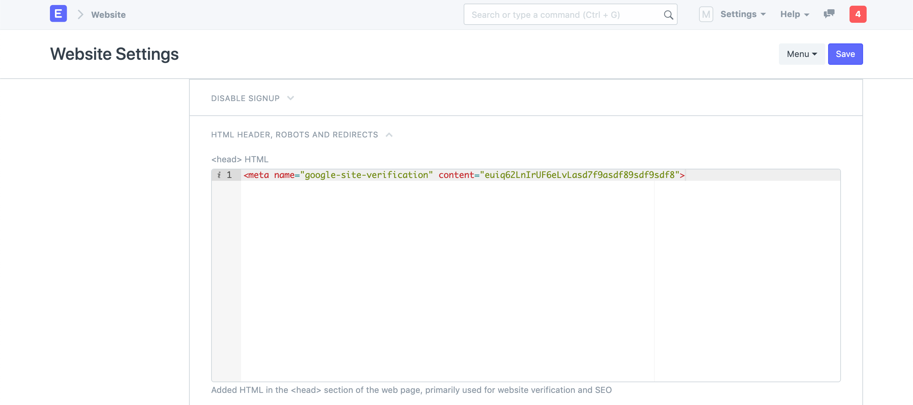 _Website Settings - Header_

## 9\. Robots

You can define `robots.txt` rules in this section. This information is used by web crawlers to decide which pages to index and which to skip.

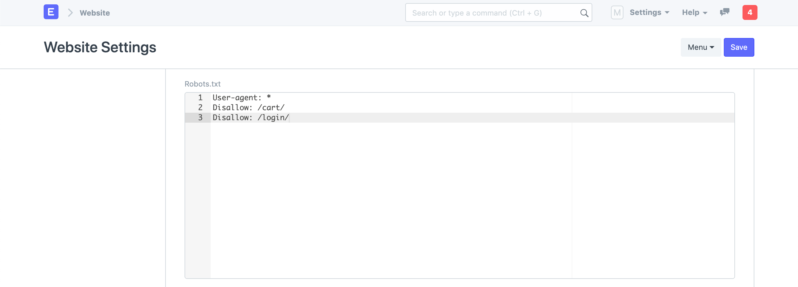 _Website Settings - Robots_

> Learn more about `robots.txt` at [Moz - Robots.txt](https://moz.com/learn/seo/robotstxt)

## 10\. Redirects

You can define a mapping of route redirects here. The mappings in the following screenshot makes sure that if a user visits `https://apple.erpnext.com/iphone`, they will be redirected to `https://apple.erpnext.com/products/iphone`.

ERPNext will raise a `301 Permanent Redirect` response for these routes.

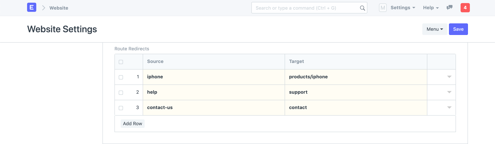 _Website Settings - Routes Redirects_

> If you are migrating your existing website to ERPNext based website, you can map your old routes to new ones here and these redirects will be picked up by Google and will help you maintain your SEO rankings.

## 11\. Chat

You can enable website visitor chat on your website in the Chat section. The chat widget will be shown between **From** time and **To** time. You can also set **Chat Operators** (Users) who will get notified when a visitor sends a message.

> Chat is an experimental feature.

[ Previous Page Website Theme  ](website-theme.md) [ Next Page Homepage  ](homepage.md)

Last updated 2 weeks ago 

Was this helpful?
