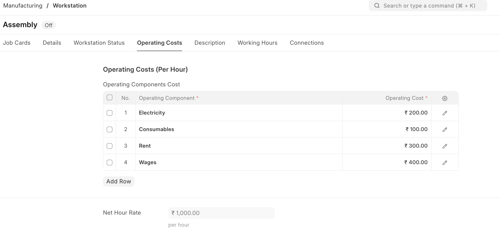
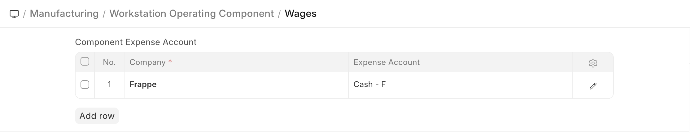
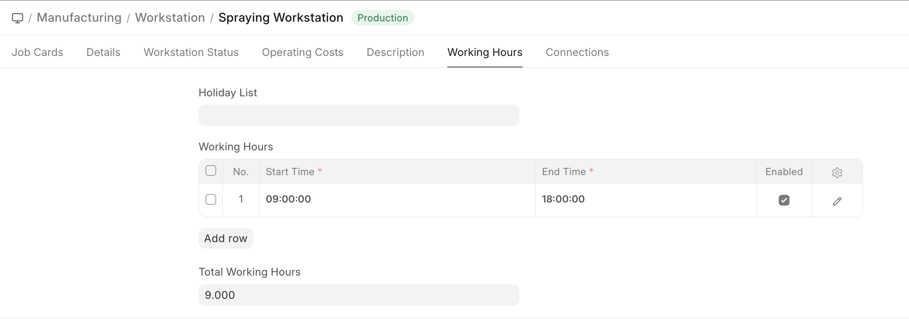
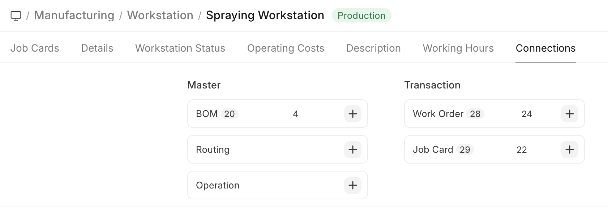
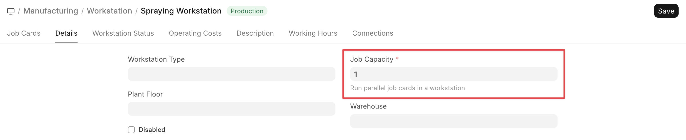

# Workstation

[ Edit ](https://docs.frappe.io/wiki/spaces/24hrpr6es9/page/0s0imp5o5m)

Open in ChatGPT  Ask ChatGPT about this page Open in Claude  Ask Claude about this page

# Workstation

[ Edit ](https://docs.frappe.io/wiki/spaces/24hrpr6es9/page/0s0imp5o5m)

Open in ChatGPT  Ask ChatGPT about this page Open in Claude  Ask Claude about this page

**A Workstation stores information regarding the place where the workstation operations are carried out.**

Data regarding the operation cost, rent, electricity can be stored here.

An Operation takes place at a Workstation. The Operation is the work performed and the Workstation is the place/machine where it is performed. For example, melting is an Operation that can be done at 10 different Workstations.

## How to create a Workstation

  1. Go to the Workstation list, click on New.
  2. Enter a name for the Workstation.
  3. Under Operating Costs, enter operating component with the cost:
  4. Electricity
  5. Rent
  6. Consumables
  7. Wages
  8. Save.

Optionally, you can enter a description for the Workstation.

* * *

### Operating Components

Using this table you can divide the different cost components and set it to the Operation.

### Workstation Operating Component

User can also define the expense account per component company wise in the Workstation Operating Component.

* * *

A [Holiday List](https://docs.frappe.io/hr/holiday-list) can be added to exclude counting these days for the Workstation.

The hours when the Workstation will be Operational can be added. On adding a Holiday list, the days listed as holidays won't be counted as working for the Workstation.

Under Working Hours table, you can add start and end times for a Workstation. For example, a Workstation may be active from 9 am to 1 pm, then 2 pm to 5 pm. You can also specify the working hours based on shifts. While scheduling a [Work Order](work-order.md), the system will check for the availability of the Workstation based on the working hours specified.

After saving the Workstation, the following actions can be performed against it:

* * *

## Features

### Production Capacity

Production Capacity is the total number of jobs can be executed at the same time in the respective workstation.

* * *

* * *

## Related Topics

  1. [Bill Of Materials](bill-of-materials.md)
  2. [Operation](operation.md)
  3. [Routing](routing.md)
  4. [Work Order](work-order.md)
  5. [Job Card](job-card.md)

[ Previous Page Operation  ](operation.md) [ Next Page Routing  ](routing.md)

Last updated 2 weeks ago 

Was this helpful?
