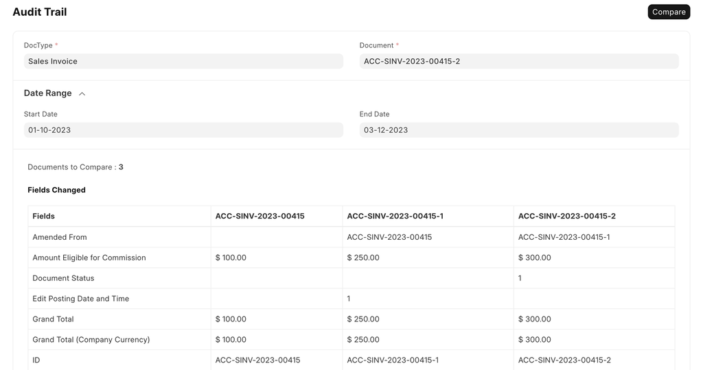
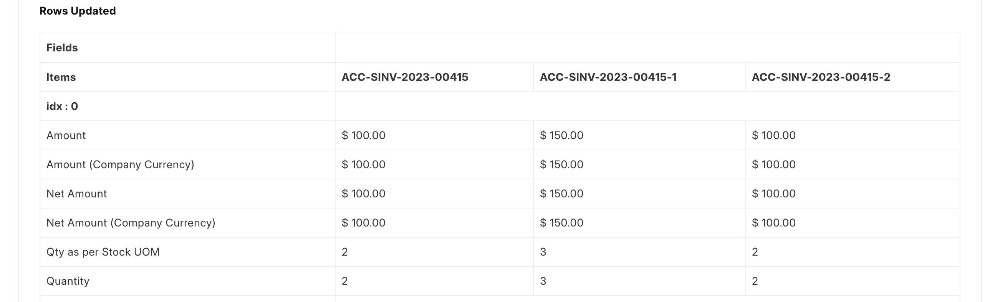
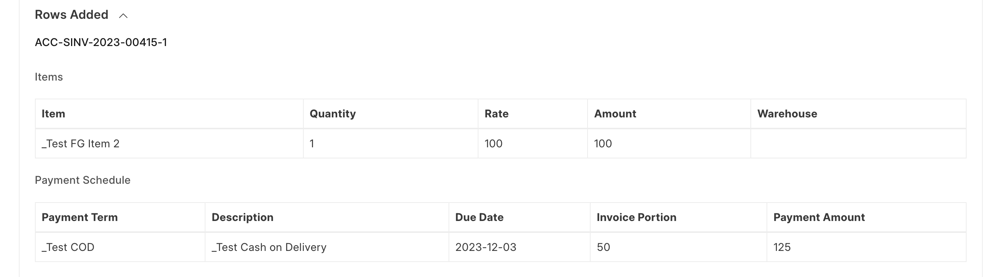

# Audit Trail

[ Edit ](https://docs.frappe.io/wiki/spaces/1u8fslkdg6/page/0tjov2htms)

Open in ChatGPT  Ask ChatGPT about this page Open in Claude  Ask Claude about this page

# Audit Trail

[ Edit ](https://docs.frappe.io/wiki/spaces/1u8fslkdg6/page/0tjov2htms)

Open in ChatGPT  Ask ChatGPT about this page Open in Claude  Ask Claude about this page

#### **Description**

A tool for viewing the changes made to a submittable doctype across multiple amended versions. In a case where a submittable document is cancelled and amended, tracking changes made to the document becomes difficult using the Version doctype since the name of the document changes. Audit Trail can be used to view **atmost 5 previously amended versions** of a submittable doctype.

#### **Steps**

  1. Select the type of the document in the **Doctype** field.
  2. Select the name of the document in the **Document** field.
  3. Optionally, select the start and end dates in order to show the amended documents within the specified date range.
  4. Click on the Compare button to view the Audit Trail for the selected document.

* * *

**Fields Changed**

Values for the fields changed across the different versions.

**Rows Updated**

Values for the child table fields changed across the different versions.

**Rows Added / Rows Removed**

Rows added or removed for every child table across the different versions.

[ Previous Page Configuration ](https://docs.frappe.io/framework/user/en/basics/site_config) [ Next Page Docstatus ](basics/doctypes/frameworktatus.md)

Last updated 3 weeks ago 

Was this helpful?
