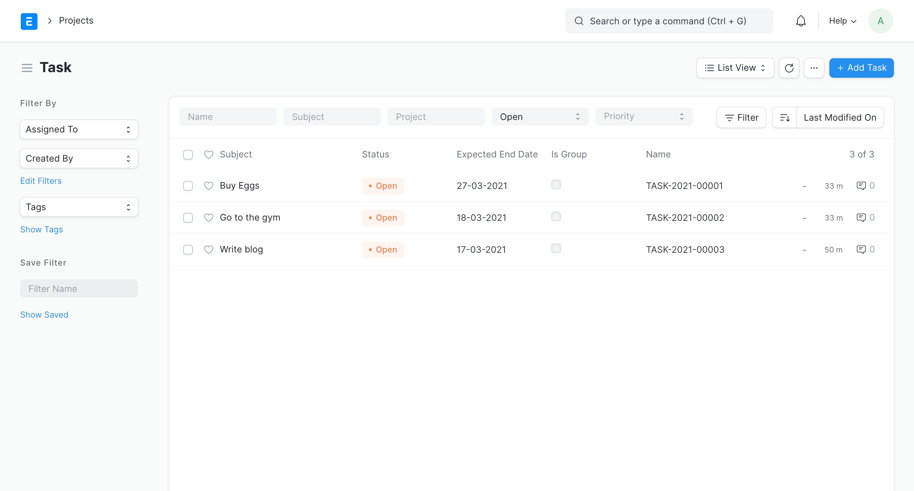
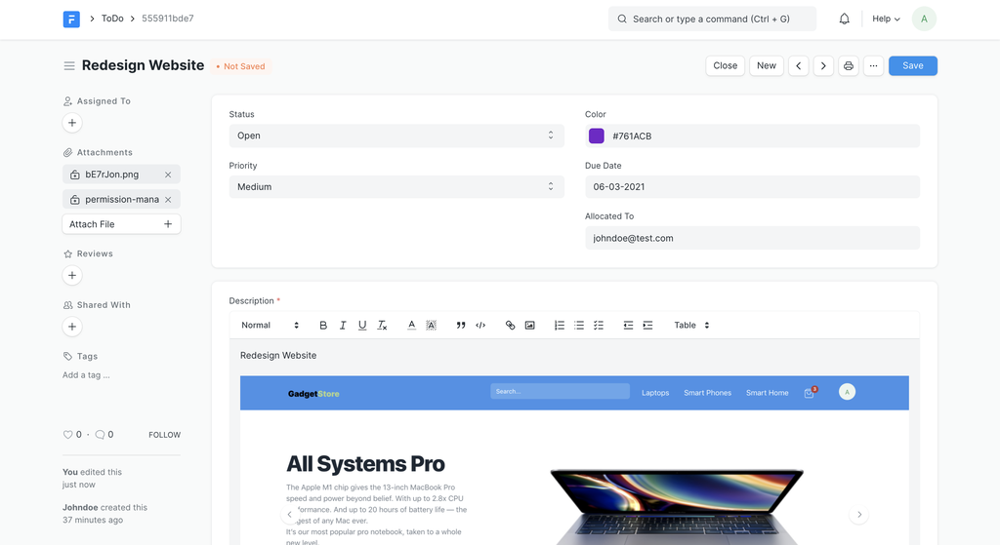
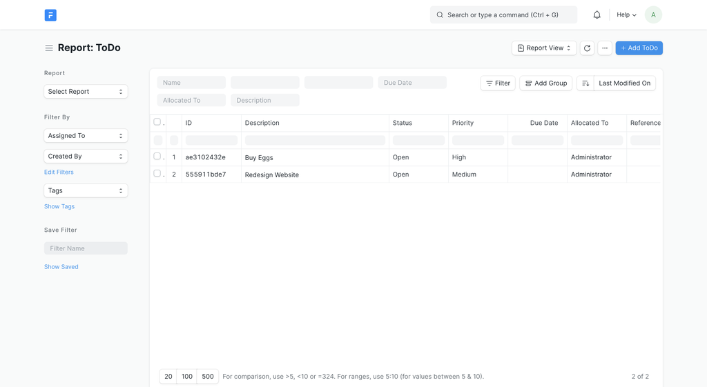
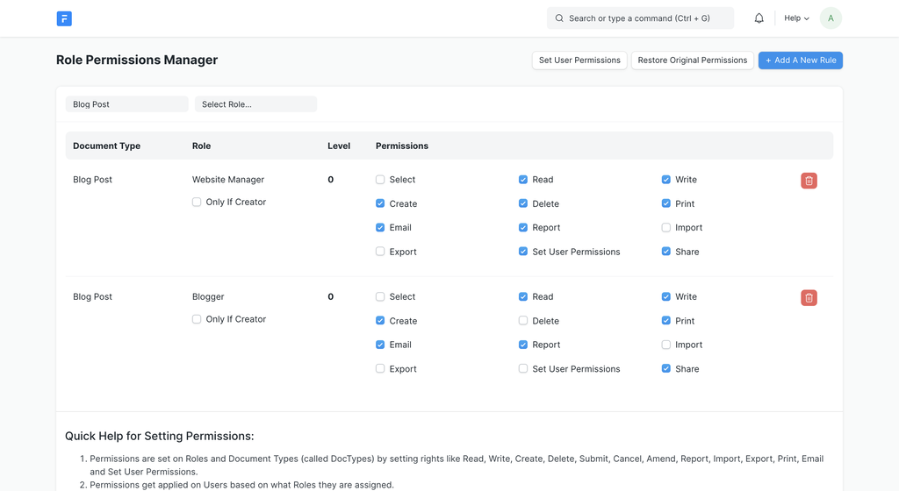
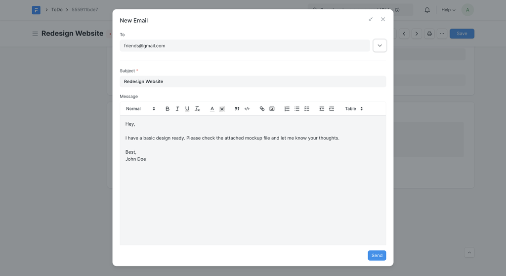
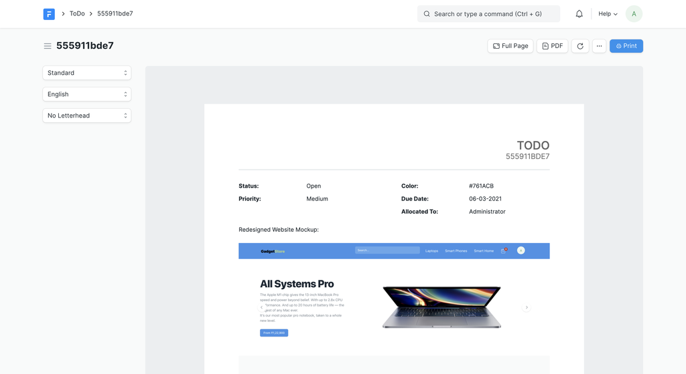
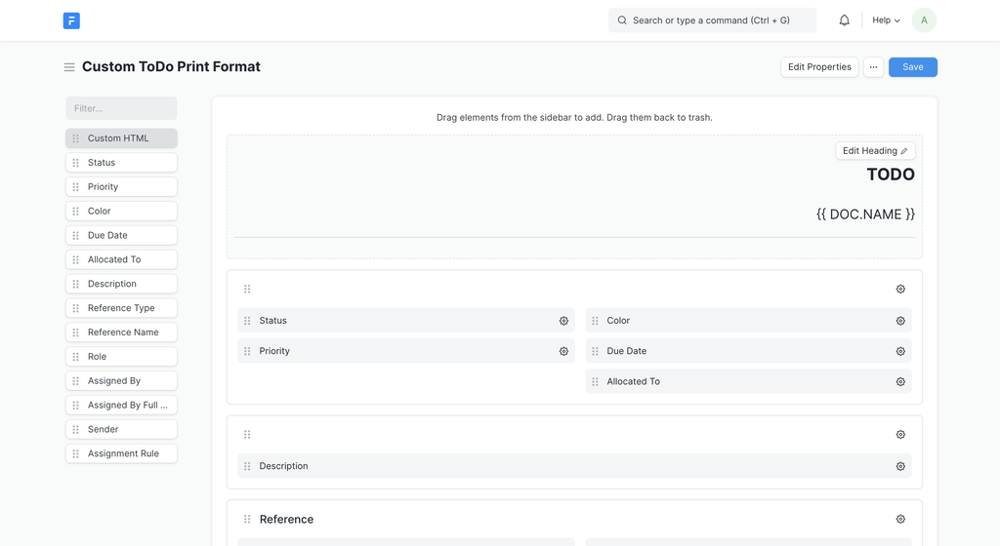

# What is Frappe Framework?

[ Edit ](https://docs.frappe.io/wiki/spaces/1u8fslkdg6/page/0tit19ea26)

Open in ChatGPT  Ask ChatGPT about this page Open in Claude  Ask Claude about this page

# What is Frappe Framework?

[ Edit ](https://docs.frappe.io/wiki/spaces/1u8fslkdg6/page/0tit19ea26)

Open in ChatGPT  Ask ChatGPT about this page Open in Claude  Ask Claude about this page

Frappe is a full stack, batteries-included, web framework written in Python and Javascript.

It is the framework which powers [ERPNext](https://erpnext.com/). It is pretty generic and can be used to build database driven apps.

## Meta-data driven

Meta-data is a first class citizen in Frappe. It is used to generate database tables, design forms and configure a lot of features. Meta-data is stored in a **Model** which is known as DocType in Frappe.

Let's take an example of a DocType called **ToDo**. It will contain fields like `status`, `date` and `description`.

Here is what the `todo.json` may look like:
[code] 
    {
     "name": "ToDo",
     "module": "Desk",
     "field_order": [
      "status",
      "date",
      "description"
     ],
     "fields": [
      {
       "default": "Open",
       "fieldname": "status",
       "fieldtype": "Select",
       "in_global_search": 1,
       "in_list_view": 1,
       "in_standard_filter": 1,
       "label": "Status",
       "options": "Open
    Closed"
      },
      {
       "fieldname": "date",
       "fieldtype": "Date",
       "in_standard_filter": 1,
       "label": "Due Date"
      },
      {
       "fieldname": "description",
       "fieldtype": "Text Editor",
       "in_global_search": 1,
       "label": "Description",
       "reqd": 1
      }
     ]
    }
      
    
    
[/code]

A configuration like this will generate a database table whose schema might look like
[code] 
    MariaDB [_baa0f26509a564b6]> desc tabToDo;
    +-----------------------+--------------+------+-----+---------+-------+
    | Field                 | Type         | Null | Key | Default | Extra |
    +-----------------------+--------------+------+-----+---------+-------+
    | name                  | varchar(140) | NO   | PRI | NULL    |       |
    | creation              | datetime(6)  | YES  |     | NULL    |       |
    | modified              | datetime(6)  | YES  | MUL | NULL    |       |
    | modified_by           | varchar(140) | YES  |     | NULL    |       |
    | owner                 | varchar(140) | YES  |     | NULL    |       |
    | docstatus             | int(1)       | NO   |     | 0       |       |
    | idx                   | int(8)       | NO   |     | 0       |       |
    | status                | varchar(140) | YES  |     | Open    |       |
    | description           | longtext     | YES  |     | NULL    |       |
    | date                  | date         | YES  |     | NULL    |       |
    +-----------------------+--------------+------+-----+---------+-------+
      
    
    
[/code]

## Rich Admin Interface

Frappe does not only manage the backend, it also comes with a feature rich admin interface called the Desk. When you create a DocType in Frappe, a number of views are generated for it. Here are some of them:

The List View supports paging, filtering, sorting and bulk editing records.

 _List View_

The Form View used for editing records also supports file attachments, PDF format, comments, email, etc.

 _Form View_

The Report Builder supports adding columns, grouping, filtering, sorting and saving it as a configuration.

 _Report Builder_

## Users, Roles and Permissions

Frappe comes with User and Role management out of the box. A **User** is someone who can login to the system and perform authorized actions like creating, updating or deleting records. A **Role** is a mapping of DocTypes and actions allowed to perform on it.

## Python, JS and MariaDB

Frappe Framework uses Python for the backend. It comes with a simple yet powerful ORM as an abstraction over CRUD operations. The default database is MariaDB. Postgres support is in beta.
[code] 
    doc = frappe.new_doc('ToDo')
    doc.description = 'Buy Eggs'
    doc.insert()
      
    
    
[/code]

The front-end is an SPA built using Javascript (jQuery).

## Realtime

Frappe also supports realtime pub/sub events using NodeJS and socketio.
[code] 
    # server
    frappe.publish_realtime('update_progress', {
        'progress': 42,
        'total': 100
    })
    
    # client
    frappe.realtime.on('update_progress', (data) => {
        console.log(data)
    });
      
    
    
[/code]

## Background Jobs

Frappe also supports background job queuing based on Python RQ.
[code] 
    frappe.enqueue('frappe.job.run_job', arg1='Test', arg2='Test2')
      
    
    
[/code]

## Email

Frappe supports sending and receiving emails, which can also be linked to individual documents.

## Printing

Frappe supports generating PDF print formats based on Jinja Templates. It also comes with a drag-and-drop Print Format Builder.

 _Print Preview_

 _Print Format Builder_

## Batteries Included

Frappe has tons of features that are essential to building a modern complex app. Only the basic features are introduced here. The rest of this guide will cover them and other advanced features with much finer detail, so make sure to read it all.

[ Previous Page What's Next? ](tutorial/whats-next.md) [ Next Page Why Frappe Framework?  ](basics/why.md)

Last updated 3 weeks ago 

Was this helpful?
