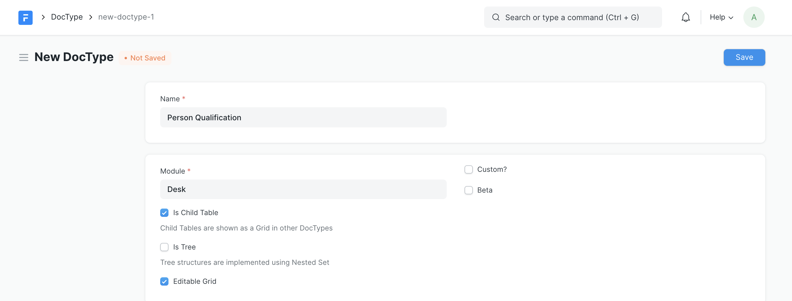
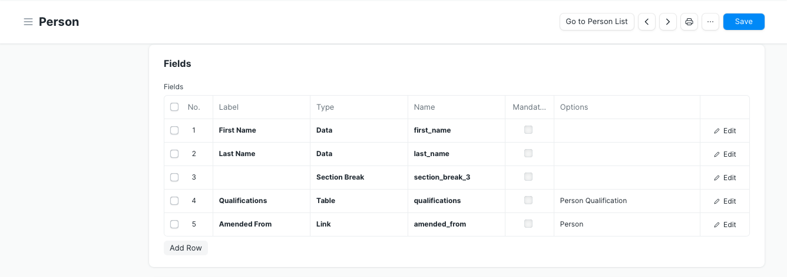

# Child / Table DocType

[ Edit ](https://docs.frappe.io/wiki/spaces/1u8fslkdg6/page/0tk2etp86v)

Open in ChatGPT  Ask ChatGPT about this page Open in Claude  Ask Claude about this page

# Child / Table DocType

[ Edit ](https://docs.frappe.io/wiki/spaces/1u8fslkdg6/page/0tk2etp86v)

Open in ChatGPT  Ask ChatGPT about this page Open in Claude  Ask Claude about this page

Up until now we have only seen DocTypes that can have a single value for each field. However, there might be a need for storing multiple records against one record, also known as many-to-one relationships. A Child DocType is doctype which can only be linked to a parent DocType. To make a Child DocType make sure to check **Is Child Table** while creating the doctype.

To link a Child Doctype to its parent, add another row in Parent Doctype with field type **Table** and options as **Child Table**.

Child DocType records are directly attached to the parent doc.
[code] 
    >>> person = frappe.get_doc('Person', '000001')
    >>> person.as_dict()
    {
     'first_name': 'John',
     'last_name': 'Doe',
     'qualifications': [
     {'title': 'Frontend Architect', 'year': '2017'},
     {'title': 'DevOps Engineer', 'year': '2016'},
     ]
    }
    
[/code]

## Child Properties

Child documents have special properties that define their relationship to their parent :

  * `parent`: name of the parent.
  * `parenttype`: DocType of the parent.
  * `parentfield`: Field in the parent that links this child to it.
  * `idx`: Sequence (row).

[ Previous Page Form & View Settings ](form_-_view_settings.md) [ Next Page Single DocType  ](single-doctype.md)

Last updated 3 weeks ago 

Was this helpful?
