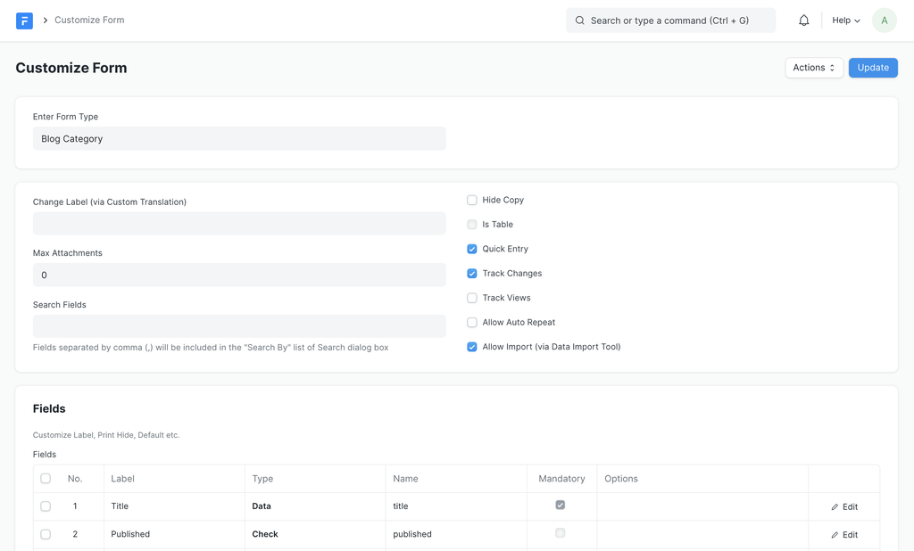

# Customizing DocTypes

[ Edit ](https://docs.frappe.io/wiki/spaces/1u8fslkdg6/page/0tk4743447)

Open in ChatGPT  Ask ChatGPT about this page Open in Claude  Ask Claude about this page

# Customizing DocTypes 

[ Edit ](https://docs.frappe.io/wiki/spaces/1u8fslkdg6/page/0tk4743447)

Open in ChatGPT  Ask ChatGPT about this page Open in Claude  Ask Claude about this page

If you are using the same application for multiple site (tenants), each site may want specific customization on top of the DocType. For example if you have a "Customer" DocType each user may want addition Custom Fields or naming or other configuration that would be specific to them.

To allow for site-specific customization, Frappe Framework has multiple approaches

  1. Custom Field: A DocType that keeps track of site-specific fields.
  2. Property Setter: This keeps track of specific properties that are overridden in DocType and its children.
  3. Customize Form: A view that helps you easily customize DocTypes
  4. [Client Script](../../../../v14/user/en/desk/scripting/client-script.md): Additional client-side event handlers.
  5. [Server Script](../../../../v14/user/en/desk/scripting/server-script.md): Additional server-side business logic.
  6. Custom DocPerm: Additional Permission (handled via Role Permission Manager)

## Customize Form

Customize Form is a view that helps you override properties of a DocType and add Custom Fields via a single view.

When you change any properties of the DocType via Customize Form, it will not change the underlying DocType but add new custom objects to override those properties. This is done in a seamless manner.

#### Adding Custom Links and Actions

> Added in Version 13

You can also add / edit Links and Actions via Customize Form. These changes are saved in the same DocTypes (`DocType Link` and `DocType Action`) but with a `custom` property checked.

These addtional (custom) configurations are automatically applied when metadata is fetched via `frappe.get_meta`.

[ Previous Page Actions and Links ](actions-and-links.md) [ Next Page Data Masking ](../../../../data-masking.md)

Last updated 3 weeks ago 

Was this helpful?
