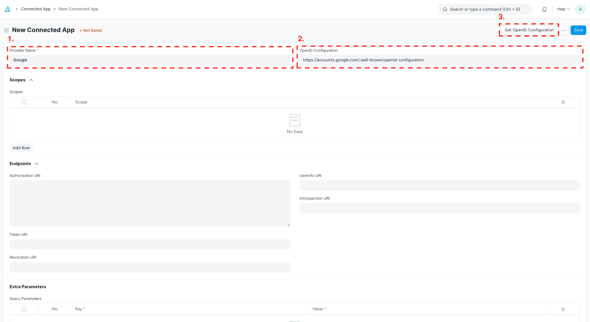
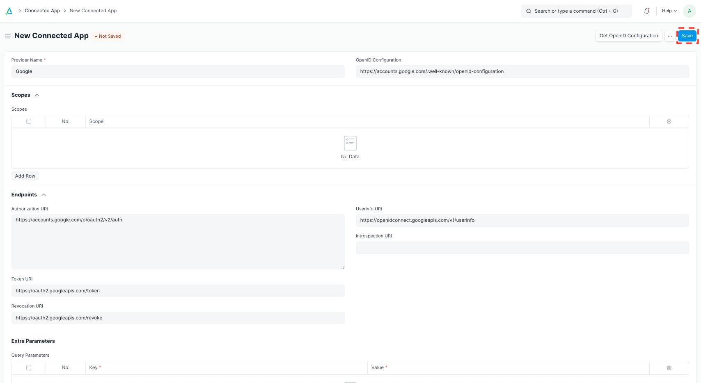
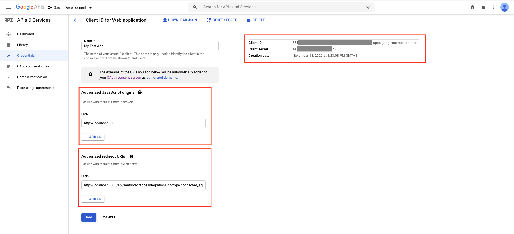
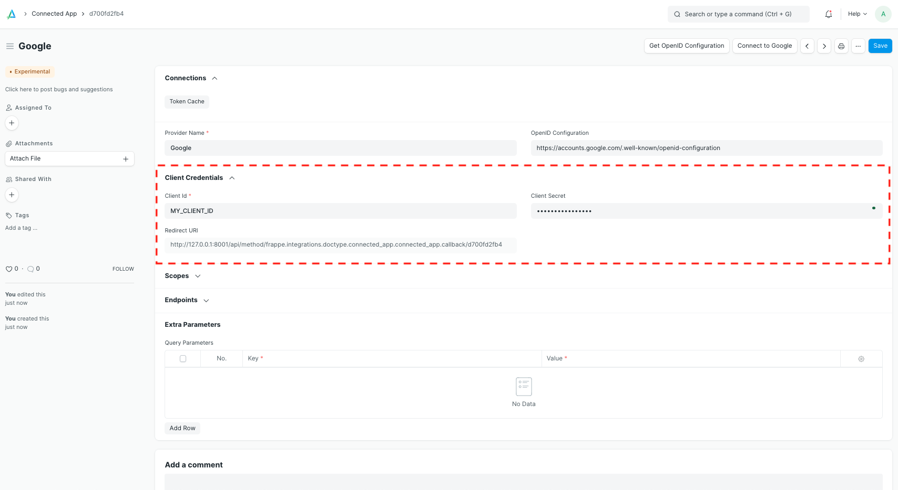
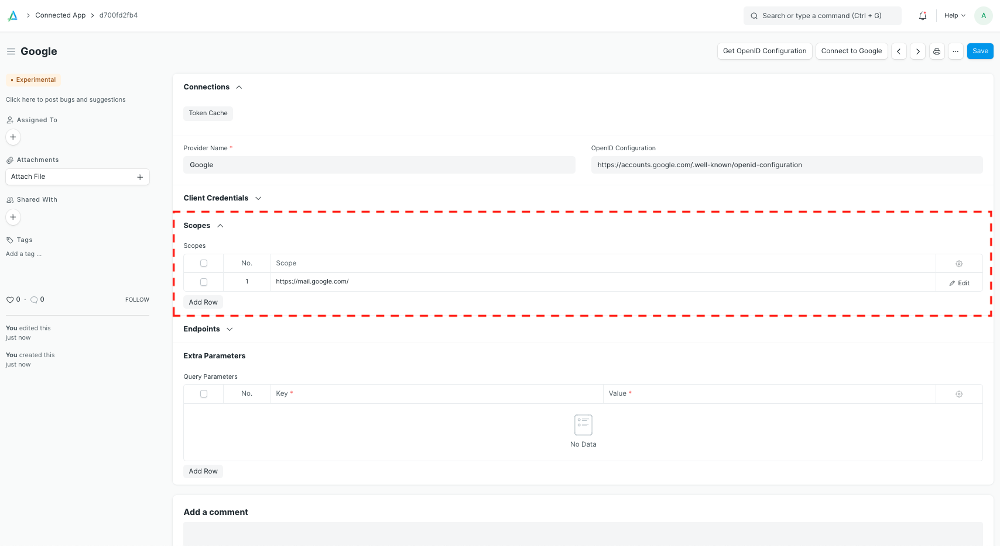
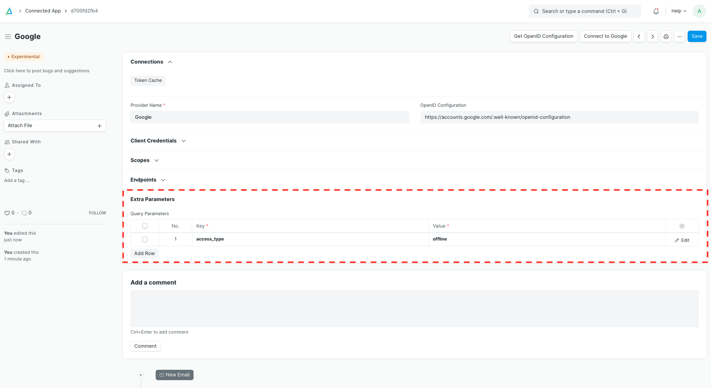
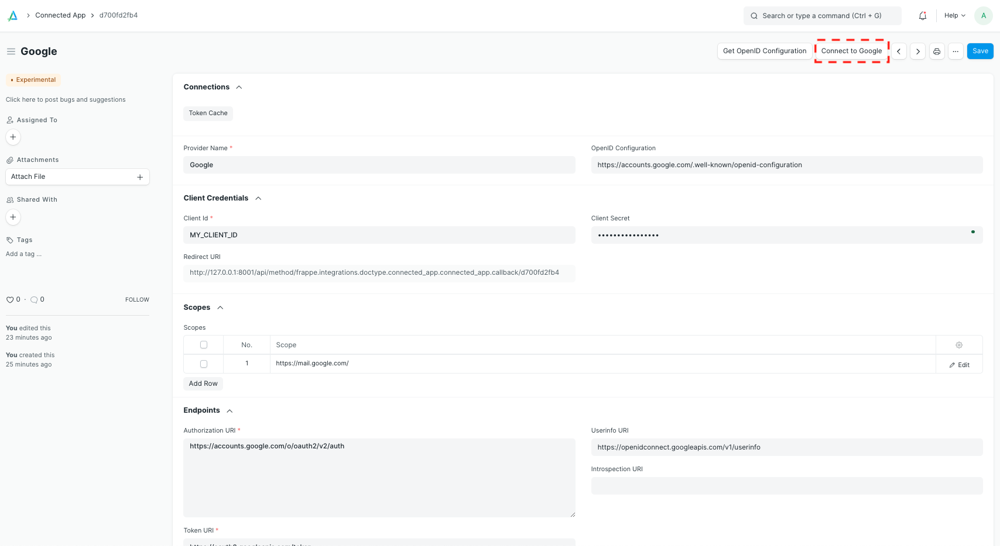

# Set up a new Connected App

[ Edit ](https://docs.frappe.io/wiki/spaces/1u8fslkdg6/page/0tr86u78do)

Open in ChatGPT  Ask ChatGPT about this page Open in Claude  Ask Claude about this page

# Set up a new Connected App

[ Edit ](https://docs.frappe.io/wiki/spaces/1u8fslkdg6/page/0tr86u78do)

Open in ChatGPT  Ask ChatGPT about this page Open in Claude  Ask Claude about this page

You can use **Connected App** to allow your frappe instance to access other web services on your behalf.

> This example shows how to connect to Google Mail, but you can use any service supporting OAuth 2.0.

First, create a new **Connected App** and give it a name. Most providers offer an URL like `/.well-known/openid-configuration` where they publish all OAuth endpoints. Enter this URL and click on "Get OpenID Configuration".

If you don't know this URL, please go to the "Endpoints" section and manually enter the _Authorization URI_ and _Token URI_. The Authorization URI is where you will be redirected to give your consent. The Token URI is the endpoint where the system can exchange an authorization code for an access or refresh token. Please check the documentation of the specific integration or third party service to get the right values.

Now the configuration should look like this:

Click on "Save". Now you should see a new read-only field called _Redirect URI_. Note that the last part of it is specific to your **Connected App**. You'll need to register the Redirect URI with your provider (Google, in this case).

Copy the Redirect URI, head to the third party service and create new OAuth 2.0 client credentials. You will need to specify the authorized JavaScript origins and the Redirect URI you just copied. Enter the domain name of your frappe instance as authorized JavaScript origin. On a production server this might be `https://erp.mycompany.com`. For local development you can use something like `http://localhost:8000`.

> It is crucial that the authorized JavaScript origins and the authorized redirect URIs are correct. Otherwise you will not be able to connect.

Copy the client ID and secret from the third party service to your **Connected App** and save.

Next, you'll need to define what scopes your system needs to access. In this example, we want to connect to an email inbox, so we need the scope `https://mail.google.com/`. For other use cases, please check the available scopes at your providers' documentation.

Lastly, we can define extra parameters. The Google documentation states that we'll need the parameter `access_type=offline`, so that for our server can access the email inbox in the background and keep refreshing the access token without user intervention. If we don't pass this parameter, the temporary access will quickly expire and we'll need to log in again and again.

Now you and your users can click on "Connect to ..." on the top right. This will open a new browser tab that shows the third party service's consent screen. After this, you will be redirected to your frappe instance.

In the backend, your server will exchange a code that it obtained during the redirect for a temporary access token and, optionally, a refresh token. These can then be used to access the third party service on your behalf.

[ Previous Page Overriding Link Query By Custom Script  ](https://docs.frappe.io/framework/user/en/guides/app-development/overriding-link-query-by-custom-script) [ Next Page Custom Module Icon ](https://docs.frappe.io/framework/user/en/guides/app-development/custom-module-icon)

Last updated 3 weeks ago 

Was this helpful?
