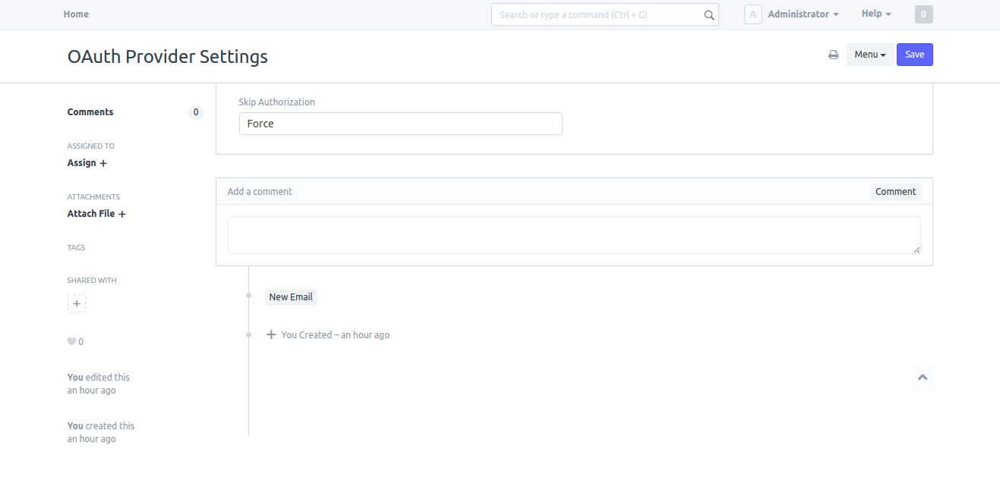
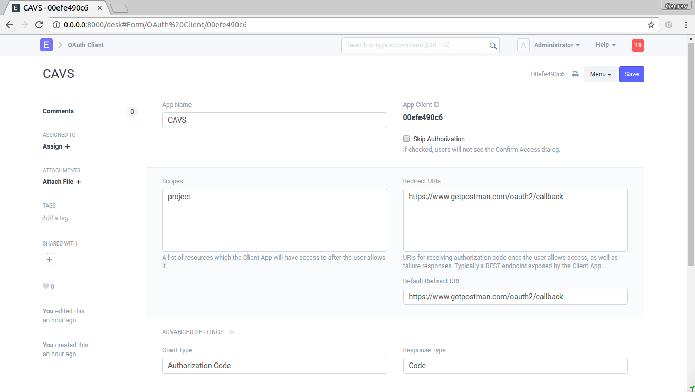

# How to setup OAuth 2?

[ Edit ](https://docs.frappe.io/wiki/spaces/1u8fslkdg6/page/0tva9l8hkf)

Open in ChatGPT  Ask ChatGPT about this page Open in Claude  Ask Claude about this page

# How to setup OAuth 2? 

[ Edit ](https://docs.frappe.io/wiki/spaces/1u8fslkdg6/page/0tva9l8hkf)

Open in ChatGPT  Ask ChatGPT about this page Open in Claude  Ask Claude about this page

[OAuth 2.0](https://tools.ietf.org/html/rfc6749) provider based on [oauthlib](https://github.com/oauthlib/oauthlib) is built into frappe. Third party apps can now access resources of users based on Frappe Role and User permission system. To setup an app to access

## OAuth 2 defines four roles

#### resource owner

An entity capable of granting access to a protected resource. When the resource owner is a person, it is referred to as an end-user.

#### resource server

The server hosting the protected resources, capable of accepting and responding to protected resource requests using access tokens.

#### client

An application making protected resource requests on behalf of the resource owner and with its authorization. The term "client" does not imply any particular implementation characteristics (e.g., whether the application executes on a server, a desktop, or other devices).

#### authorization server

The server issuing access tokens to the client after successfully authenticating the resource owner and obtaining authorization.

## Setup OAuth 2 Provider

System Managers can setup behavior of confirmation message as `Force` or `Auto` in OAuth Provider Settings. If Force is selected the system will always ask for user's confirmation. If Auto is selected system asks for the confirmation only if there are no active tokens for the user.

Go to

> Setup > Integrations > OAuth Provider Settings

### Add Primary Server

This is the main server hosting all the users. e.g. `https://frappe.io`. To setup this as the main server, go to _Setup_ > _Integrations_ > _Social Login Key_ and add new `Frappe Social Login Key`. Enter `https://frappe.io` in the field `Base URL`. This URL repeats in all other Frappe servers who connect to this server to authenticate. Effectively, this is the main Identity Provider (IDP).

Under this server add as many `OAuth Client`(s) as required.

## Add a Client App

As a System Manager go to

> Setup > Integrations > OAuth Client

To add a client fill in the following details

  1. **App Name** : Enter App Name e.g. CAVS
  2. **Skip Authorization** : If this is checked, during authentication there won't be me any confirmation message. Skip Authorization means the client is treated as trusted client.
  3. **Scopes** : List of scopes shown to user along with confirmation message. scopes are separated by space.
  4. **Redirect URIs** : List of Redirect URIs separated by space.
  5. **Default Redirect URIs** : Default Redirect URI from list of Redirect URIs
  6. **Grant Type** : select `Authorization Code` or `Implicit`.
  7. **Response Type** : select `Code` if grant type is `Authorization Code` or select `Token`.

## Using OAuth 2

Please refer to the API documentation to learn how to use OAuth 2 in you application.

[ Previous Page Google Calendar Integration  ](https://docs.frappe.io/framework/user/en/guides/integration/google_calendar) [ Next Page Token based authentication  ](https://docs.frappe.io/framework/user/en/guides/integration/how_to_set_up_token_based_auth)

Last updated 3 weeks ago 

Was this helpful?
