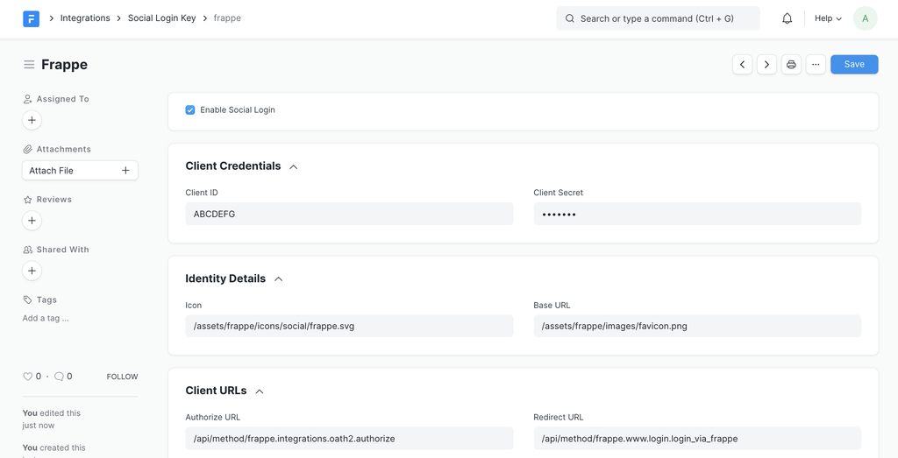

# Social Login Key

[ Edit ](https://docs.frappe.io/wiki/spaces/1u8fslkdg6/page/0tv1d0og0h)

Open in ChatGPT  Ask ChatGPT about this page Open in Claude  Ask Claude about this page

# Social Login Key 

[ Edit ](https://docs.frappe.io/wiki/spaces/1u8fslkdg6/page/0tv1d0og0h)

Open in ChatGPT  Ask ChatGPT about this page Open in Claude  Ask Claude about this page

Add social login providers like Facebook, Frappe, Github, Google, Microsoft, etc and enable social login.

#### Setup Social Logins

To add Social Login Key go to

> Integrations > Authentication > Social Login Key

Social Login Key

  1. Select the Social Login Provider or select "Custom"
  2. If required for provider enter "Base URL"
  3. To enable check "Enable Social Login" to show Icon on login screen
  4. Also add Client ID and Client Secret as per provider.

e.g. Social Login Key

  * **Social Login Provider** : `Frappe`
  * **Client ID** : `ABCDEFG`
  * **Client Secret** : `123456`
  * **Enable Social Login** : `Check`
  * **Base URL** : `https://erpnext.org` (required for some providers)

#### Generating Client ID and Client Secret for providers

  * [Creating a Google API Console project and client ID](https://developers.google.com/identity/sign-in/web/devconsole-project)
  * [Manually Build a Login Flow for Facebook](https://developers.facebook.com/docs/facebook-login/manually-build-a-login-flow)
  * [Creating an OAuth App for GitHub](https://developer.github.com/apps/building-oauth-apps/creating-an-oauth-app/)
  * [Authorize access to web applications using OpenID Connect and Azure Active Directory](https://docs.microsoft.com/en-us/azure/active-directory/develop/active-directory-protocols-openid-connect-code)
  * [Create a Connected App on Salesforce](https://help.salesforce.com/articleView?id=connected_app_create.htm)

[ Previous Page Webhooks ](https://docs.frappe.io/framework/user/en/guides/integration/webhooks) [ Next Page Google Calendar Integration  ](https://docs.frappe.io/framework/user/en/guides/integration/google_calendar)

Last updated 3 weeks ago 

Was this helpful?
