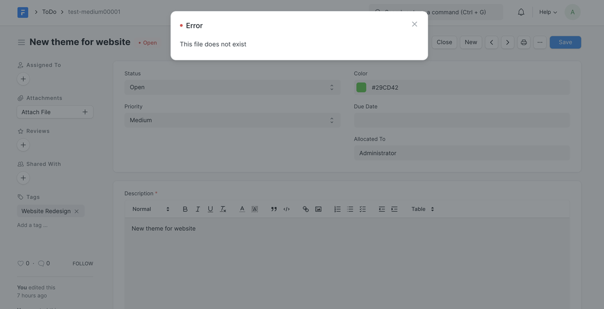
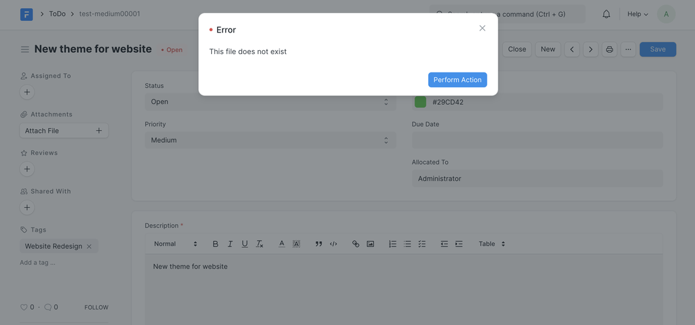

# Dialog API

[ Edit ](https://docs.frappe.io/wiki/spaces/r3uvq1ch61/page/12ugbbtm87)

Open in ChatGPT  Ask ChatGPT about this page Open in Claude  Ask Claude about this page

# Dialog API 

[ Edit ](https://docs.frappe.io/wiki/spaces/r3uvq1ch61/page/12ugbbtm87)

Open in ChatGPT  Ask ChatGPT about this page Open in Claude  Ask Claude about this page

Frappe provides a group of standard, interactive and flexible dialogs that are easy to configure and use. There's also a more extensive API for [Javascript](dialog.md).

### frappe.msgprint

`frappe.msgprint(msg, title, raise_exception, as_table, as_list, indicator, primary_action)`

This method works only within a request / response cycle. It shows a message to the user logged in to Desk who initiated the request.

The argument list includes:

  * `msg`: The message to be displayed
  * `title`: Title of the modal
  * `as_table`: If `msg` is a list of lists, render as HTML table
  * `as_list`: If `msg` is a list, render as HTML unordered list
  * `primary_action`: Bind a primary server/client side action.
  * `raise_exception`: Exception

[code] 
    frappe.msgprint(
     msg='This file does not exist',
     title='Error',
     raise_exception=FileNotFoundError
    )
    
[/code]

 _frappe.msgprint_

`primary_action` can contain a `server_action` **or** `client_side` action which must contain dotted paths to the respective methods. The JavaScript function must be a globally available function.
[code] 
    # msgprint with server and client side action
    frappe.msgprint(msg='This file does not exist',
     title='Error',
     raise_exception=FileNotFoundError
     primary_action={
     'label': _('Perform Action'),
     'server_action': 'dotted.path.to.server.method',
     'client_action': 'dotted.path.to.client.method',
     'args': args
     }
    )
    
[/code]

 _frappe.msgprint with primary action_

### frappe.throw

`frappe.throw(msg, exc, title)`

This method will raise an exception as well as show a message in Desk. It is essentially a wrapper around `frappe.msgprint`.

`exc` can be passed an optional exception. By default it will raise a `ValidationError` exception.
[code] 
    frappe.throw(
     title='Error',
     msg='This file does not exist',
     exc=FileNotFoundError
    )
    
[/code]

 _frappe.throw_

[ Previous Page FullTextSearch API ](full-text-search.md) [ Next Page Query Builder  ](query-builder.md)

Last updated 2 months ago 

Was this helpful?
