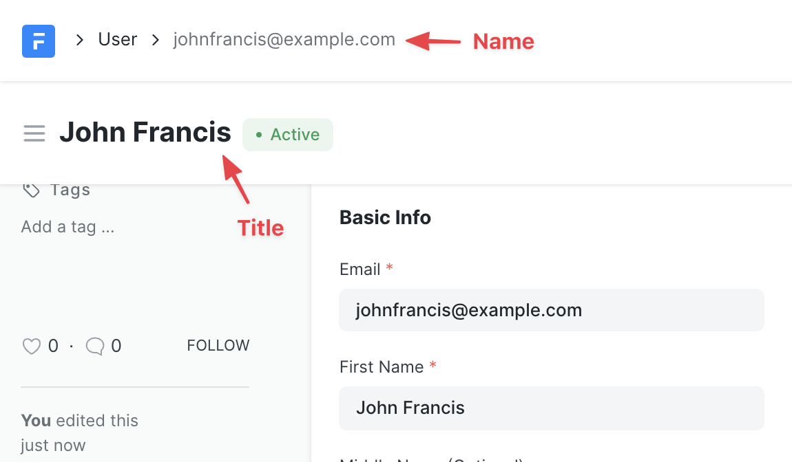
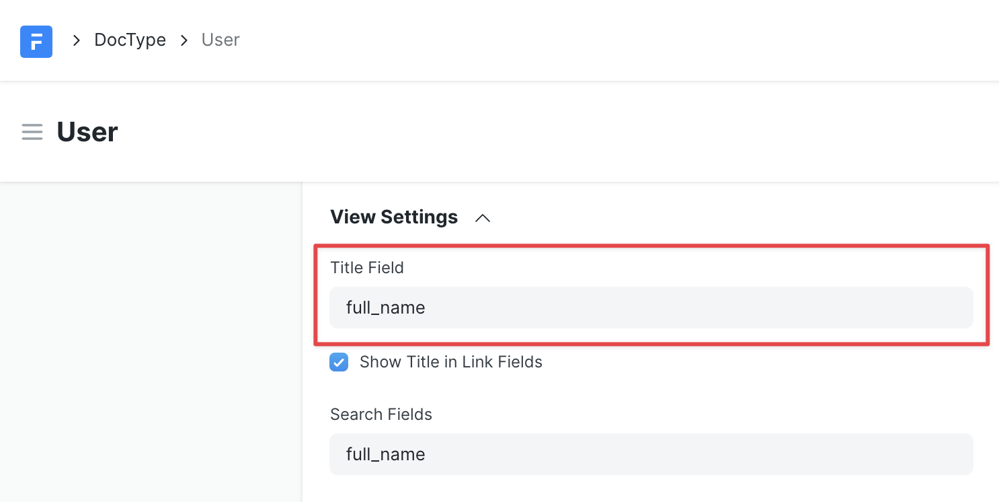
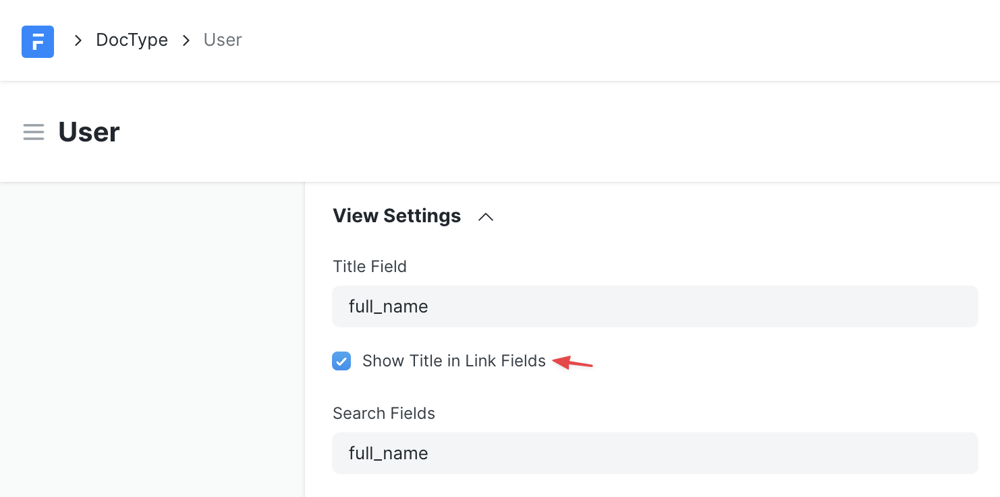
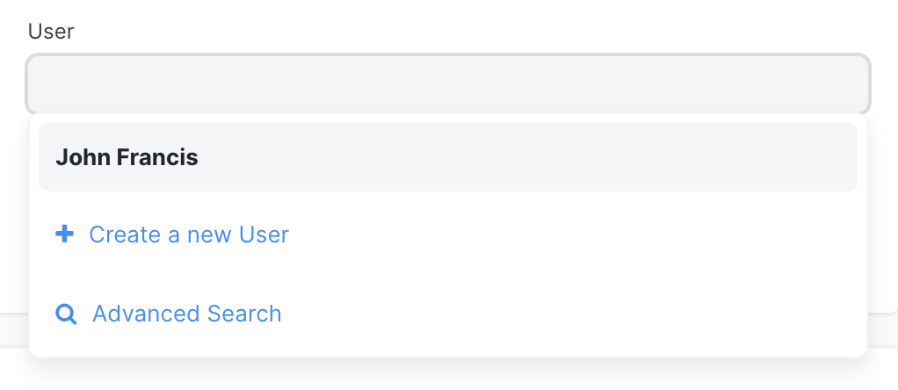

# Form & View Settings

[ Edit ](https://docs.frappe.io/wiki/spaces/r3uvq1ch61/page/12l2lqen1r)

Open in ChatGPT  Ask ChatGPT about this page Open in Claude  Ask Claude about this page

# Form & View Settings

[ Edit ](https://docs.frappe.io/wiki/spaces/r3uvq1ch61/page/12l2lqen1r)

Open in ChatGPT  Ask ChatGPT about this page Open in Claude  Ask Claude about this page

## **View Settings**

## Title Field

A field of the DocType which will be displayed as a title in the Form

**Set the title field**

Enter the name of a custom field in 'Title Field'

**Show Title in Link Fields**

You can enable **Show Title in Link Fields** to display **Title** instead of **Name** in the **Link Fields** in another doctype.

So if a custom field of 'link' type is added in another doctype (or through customize form), then the title of the linked document will be displayed in the field instead of name.

[ Previous Page Controllers ](controllers.md) [ Next Page Child / Table DocType ](child-doctype.md)

Last updated 2 months ago 

Was this helpful?
