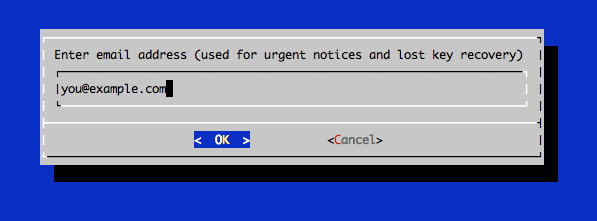
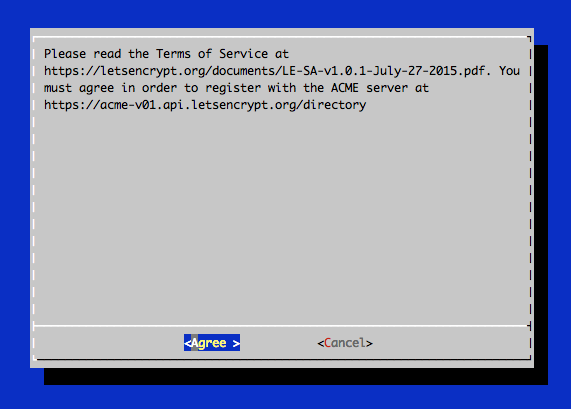
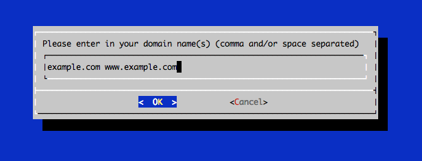

# Using Let's Encrypt to setup HTTPS

[ Edit ](https://docs.frappe.io/wiki/spaces/r3uvq1ch61/page/1339cj55ns)

Open in ChatGPT  Ask ChatGPT about this page Open in Claude  Ask Claude about this page

# Using Let's Encrypt to setup HTTPS 

[ Edit ](https://docs.frappe.io/wiki/spaces/r3uvq1ch61/page/1339cj55ns)

Open in ChatGPT  Ask ChatGPT about this page Open in Claude  Ask Claude about this page

## Prerequisites

  1. You need to have a [DNS Multitenant Setup](https://frappe.io/docs/v14/user/en/bench/guides/setup-multitenancy)
  2. Your site should be accessible via a valid domain
  3. You need root permissions on your server

**Note : Let's Encrypt Certificates expire every three months**

## Using Bench Command

Just run:

sudo -H bench setup lets-encrypt [site-name]

You will be faced with several prompts, respond to them accordingly. This command will also add an entry to the crontab of the root user _(this requires elevated permissions)_ , that will attempt to renew the certificate every month.

### Custom Domains

You can setup Let's Encrypt for [custom domains](adding-custom-domains.md) as well. Just use the `--custom-domain` option

sudo -H bench setup lets-encrypt [site-name] --custom-domain [custom-domain]

### Renew Certificates

To renew certificates manually you can use:

sudo bench renew-lets-encrypt

* * *

## Manual Method

### Download the appropriate Certbot-auto script into /opt

https://certbot.eff.org/

### Stop nginx service

$ sudo service nginx stop

### Run Certbot

$ ./opt/certbot-auto certonly --standalone

After letsencrypt initializes, you will be prompted for some information. This exact prompts may vary depending on if you've used Let's Encrypt before, but we'll step you through the first time.

At the prompt, enter an email address that will be used for notices and lost key recovery:

Then you must agree to the Let's Encrypt Subscribe Agreement. Select Agree:

Then enter your domain name(s). Note that if you want a single cert to work with multiple domain names (e.g. example.com and www.example.com), be sure to include all of them:

### Certificate Files

After obtaining the cert, you will have the following PEM-encoded files:

  * **cert.pem** : Your domain's certificate
  * **chain.pem** : The Let's Encrypt chain certificate
  * **fullchain.pem** : cert.pem and chain.pem combined
  * **privkey.pem** : Your certificate's private key

These certificates are stored under `/etc/letsencrypt/live/example.com` folder

### Configure the certificates for your site(s)

Go to your erpnext sites site_config.json

$ cd frappe-bench/sites/{{site_name}}

Add the following two lines to your site_config.json

"ssl_certificate": "/etc/letsencrypt/live/example.com/fullchain.pem", "ssl_certificate_key": "/etc/letsencrypt/live/example.com/privkey.pem"

Regenerate the nginx configuration

$ bench setup nginx

Restart the nginx server

$ sudo service nginx restart

* * *

### Auto renewal (experimental)

Login as root or a user with superuser privileges, run `crontab -e` and enter:

# renew letsencrypt certificates on 1st monday of every month and get an email if it gets executed

MAILTO="mail@example.com" 0 0 1-7 * * [ "$(date '+%a')" = "Mon" ] && sudo service nginx stop && /opt/certbot-auto renew && sudo service nginx start

[ Previous Page Diagnosing The Scheduler  ](diagnosing-the-scheduler.md) [ Next Page Setting Limits for your Site  ](settings-limits.md)

Last updated 2 months ago 

Was this helpful?
