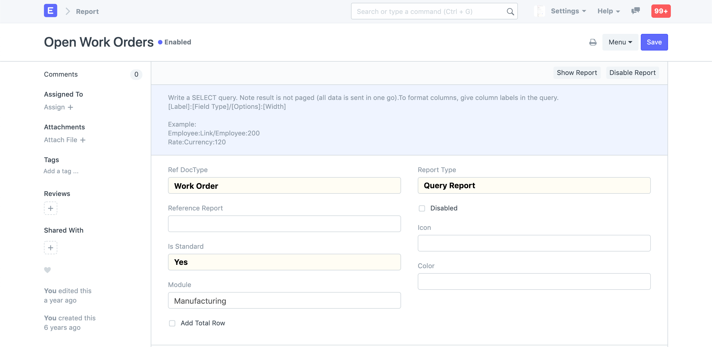
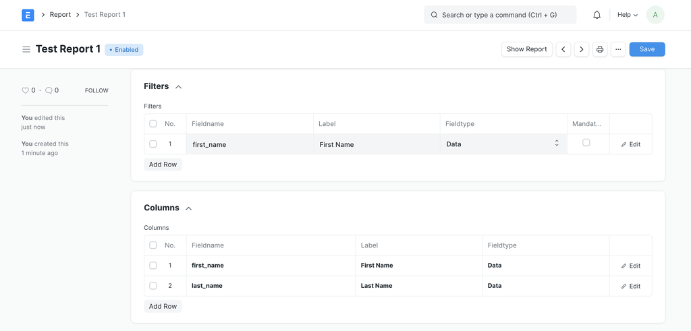
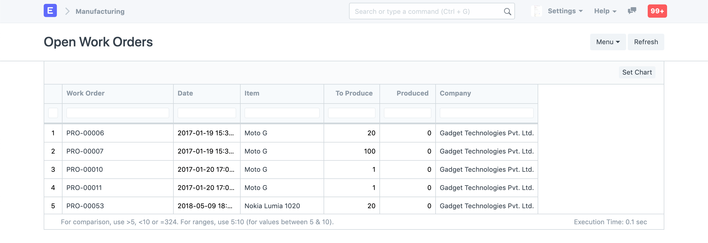

# Query Report

[ Edit ](https://docs.frappe.io/wiki/spaces/r3uvq1ch61/page/12o9nt8bem)

Open in ChatGPT  Ask ChatGPT about this page Open in Claude  Ask Claude about this page

# Query Report 

[ Edit ](https://docs.frappe.io/wiki/spaces/r3uvq1ch61/page/12o9nt8bem)

Open in ChatGPT  Ask ChatGPT about this page Open in Claude  Ask Claude about this page

Query Reports are reports that can be generated using a single SQL query. The query can be simple or complex as long as it generates columns and records. These reports can only be created by a System Manager and are stored in the database.

To create a Query Report, type "new report" in the awesomebar and hit enter.

  1. Set Report Type as "Query Report"
  2. Set the Reference DocType - Users that have access to the Reference DocType will have access to the report
  3. Set the Module - The report will appear in the "Custom Reports" section of the module.
  4. Write your query

> If you set Standard as "Yes" and Developer Mode is enabled, then a JSON file will be generated which you will have to check in to your version control. You should do this only if you want to bundle Query Reports with your app. The Module will decide where the JSON file will go.

### Columns and Filters

> Added in Version 13

You can configure the columns and filters in the Report document. Here you can set the label, width, format (fieldtype) for the columns and filters.

Filters can be used as formatting variables in the query. For example a filters of type `customer` can be used as `%(customer)s` in the query.

#### Example
[code] 
    SELECT
     name, creation, production_item, qty, produced_qty, company
    FROM
     `tabWork Order`
    WHERE
     docstatus=1
     AND ifnull(produced_qty,0) < qty
    
[/code]

### Formatting columns (Old Style)

Alternatively columns can also be formatted by specifying the label of the column in a particular format: `{label}:{optional fieldtype}{optional /}{optional options}:{optional width}`

If you have configured the fields and columns in the Report itself, you do not need to use this style.

#### Example (Old Style)

Here is what a query may look like:
[code] 
    SELECT
     `tabWork Order`.name as "Work Order:Link/Work Order:200",
     `tabWork Order`.creation as "Date:Date:120",
     `tabWork Order`.production_item as "Item:Link/Item:150",
     `tabWork Order`.qty as "To Produce:Int:100",
     `tabWork Order`.produced_qty as "Produced:Int:100",
     `tabWork Order`.company as "Company:Link/Company:"
    FROM
     `tabWork Order`
    WHERE
     `tabWork Order`.docstatus=1
     AND ifnull(`tabWork Order`.produced_qty,0) < `tabWork Order`.qty
     AND NOT EXISTS (SELECT name from `tabStock Entry` where work_order =`tabWork Order`.name)
    
[/code]

If you notice there is a special syntax for each column, we use this information to format the Report View.

For example: The first column `Work Order:Link/Work Order:200` will be rendered as a Link Field with the DocType Work Order and the column width would be 200px.

 _Query Report View_

[ Previous Page Script Report  ](script-report.md) [ Next Page Report Builder  ](report-builder.md)

Last updated 2 months ago 

Was this helpful?
