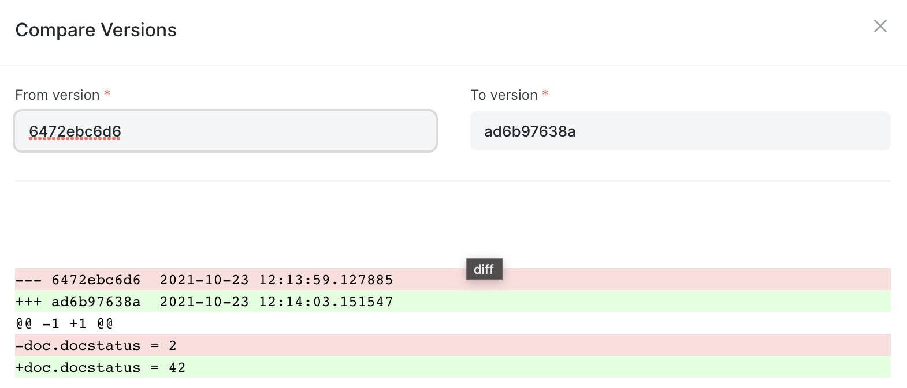

# Server Script

[ Edit ](https://docs.frappe.io/wiki/spaces/r3uvq1ch61/page/12oish797u)

Open in ChatGPT  Ask ChatGPT about this page Open in Claude  Ask Claude about this page

# Server Script

[ Edit ](https://docs.frappe.io/wiki/spaces/r3uvq1ch61/page/12oish797u)

Open in ChatGPT  Ask ChatGPT about this page Open in Claude  Ask Claude about this page

A Server Script lets you dynamically define a Python Script that is executed on the server on a document event or API

  1. How to create a Server Script

* * *

To create a Server Script

  1. If your site is being hosted on [erpnext.com](https://erpnext.com/), contact support to activate Server Script. In case of self-hosted accounts, set `server_script_enabled` as true in site_config.json of your site.

  2. To add/edit Server Script, ensure your role is System Manager.

  3. Type "New Server Script" in the awesomebar and hit enter to create a new Server Script document.

  4. Set the type of server script (Document Event / API).

  5. Set the document type and event name, or method name, script and save.

  6. Features

* * *

### 2.1 Enabling Server Script

Server script must be enabled via site_config.json
[code] 
    bench --site site1.local set-config server_script_enabled true
    
    
[/code]

### 2.2 Document Events

For scripts that are to be called via document events, you must set the Reference Document Type and Event Name to define the trigger

  * Before Insert
  * After Insert
  * Before Validate
  * Before Save
  * After Save
  * Before Submit
  * After Submit
  * Before Cancel
  * After Cancel
  * Before Delete
  * After Delete
  * Before Save (Submitted Document)
  * After Save (Submitted Document)

### 2.3 API Scripts

API endpoints can be created on the fly by using the **Script Type** `"API"`. The name of the endpoint depends on field **API Method**. All APIs created using Server Scripts will be automatically prefixed with `/api/method`.

For instance, a script with the **API Method** `"delete-note"` may be accessed via `/api/method/delete-note`. Using Frappe's frontend request library, you could use `frappe.call("delete-note")` in your client scripts.

Guest access may be enabled by checking **Allow Guest** for the created APIs. The response can be set via `frappe.response["message"]` object.

API server scripts also support IP-based rate limiting which you can enable by checking "Enable Rate Limit" and specifying how many calls can be made in a given time window.

### 2.3 Security

Frappe Framework uses the RestrictedPython library to restrict access to methods available for server scripts. Only the safe methods, listed below are available in server scripts.

For allowed methods, see [Script API](script-api.md)

### 2.4 Using Server Scripts as libraries

You can use a server script as an internal method by setting `frappe.flags` value in script.

### 2.5 Comparing changes

You can diff two versions of server scripts using "Compare Versions" button.

  3. Examples

* * *

### 3.1 Change the value of a property before change

Script Type: Before Save
[code] 
    if "test" in doc.description:
        doc.status = 'Closed'
    
    
[/code]

### 3.2 Custom validation

Script Type: "Before Save"
[code] 
    if "validate" in doc.description:
        raise frappe.ValidationError
    
    
[/code]

### 3.3. Auto Create To Do

Script Type: "After Save"
[code] 
    if doc.allocted_to:
        frappe.get_doc(dict(
            doctype = 'ToDo',
            owner = doc.allocated_to,
            description = doc.subject
        )).insert()
    
    
[/code]

### 3.4 API

  * Script Type: API
  * Method Name: `test_method`

[code] 
    frappe.response['message'] = "hello"
    
    
[/code]

Request: `/api/method/test_method`

### 3.5 Internal Library

> New in version 13

Call one (`script_1` script from another `script_2`)

Script 1:
[code] 
    frappe.flags.my_key = 'my value'
    
    
[/code]

Script 2:
[code] 
    my_key = run_script('script_1').get('my_key')
    
    
[/code]

[ Previous Page System Console  ](system-console.md) [ Next Page Script API  ](script-api.md)

Last updated 2 months ago 

Was this helpful?
