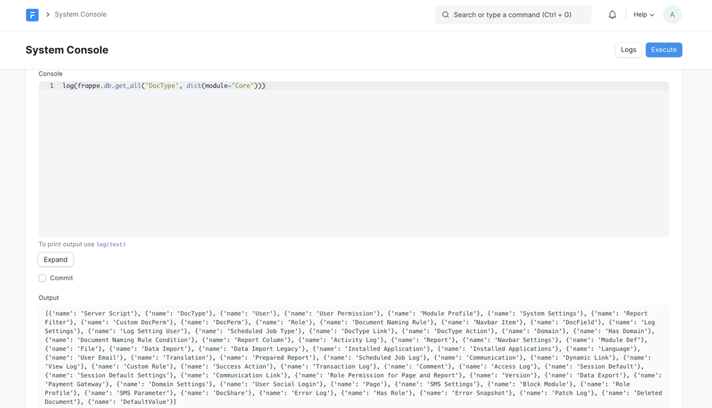

# System Console

[ Edit ](https://docs.frappe.io/wiki/spaces/r3uvq1ch61/page/12og4niuom)

Open in ChatGPT  Ask ChatGPT about this page Open in Claude  Ask Claude about this page

# System Console 

[ Edit ](https://docs.frappe.io/wiki/spaces/r3uvq1ch61/page/12og4niuom)

Open in ChatGPT  Ask ChatGPT about this page Open in Claude  Ask Claude about this page

System Console helps you run Python commands for debugging based on [Script API](script-api.md) . It is allowed only for users with role System Manager.

To access the System Console, search for it on the Search Bar.

### API

The methods exposed by the [Script API](script-api.md) can be accessed via the System Console

### Logging response

To print the response, use the `log` method.

[ Previous Page Client Script  ](client-script.md) [ Next Page Server Script ](server-script.md)

Last updated 2 months ago 

Was this helpful?
