# Blocks

[ Edit ](https://docs.frappe.io/wiki/spaces/r3uvq1ch61/page/12n4n37fge)

Open in ChatGPT  Ask ChatGPT about this page Open in Claude  Ask Claude about this page

# Blocks

[ Edit ](https://docs.frappe.io/wiki/spaces/r3uvq1ch61/page/12n4n37fge)

Open in ChatGPT  Ask ChatGPT about this page Open in Claude  Ask Claude about this page

Blocks as the name suggest are the building blocks of the workspace. You can add different types of blocks, edit them, and arrange them as per your need to build a fully customizable workspace.

There are currently 9 blocks. We will keep adding new blocks in the coming future.

Let's go through each of them:

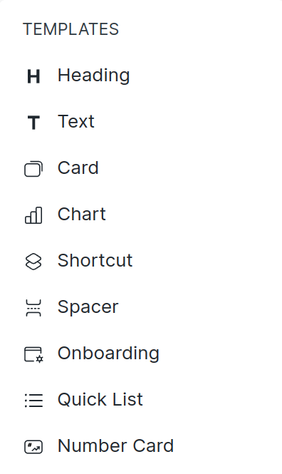

###Heading A heading block is used as a header for any section or paragraph. 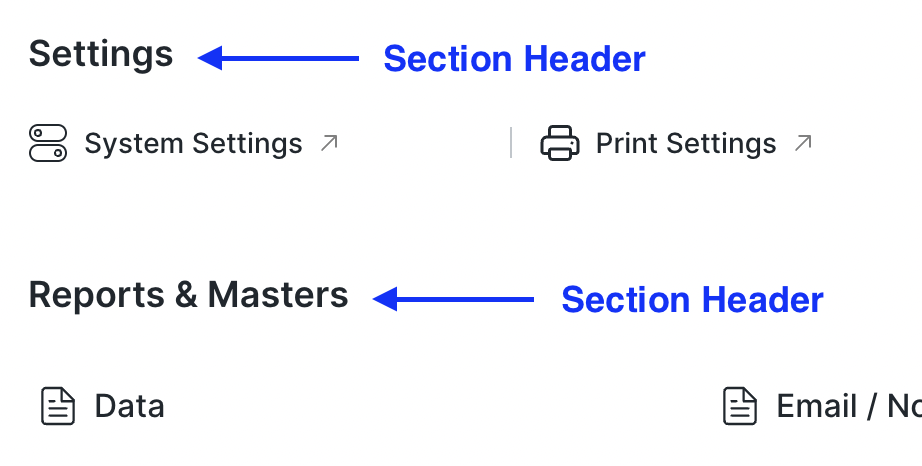 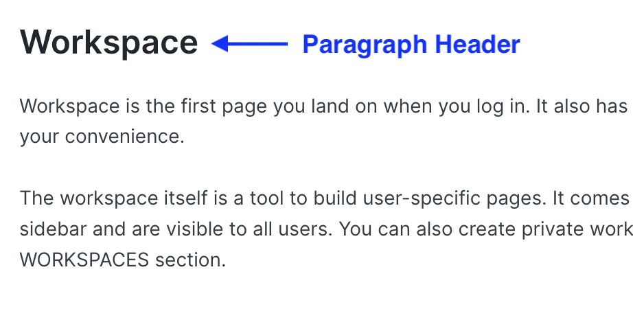

###Text Text block is used as a paragraph or description for any section. 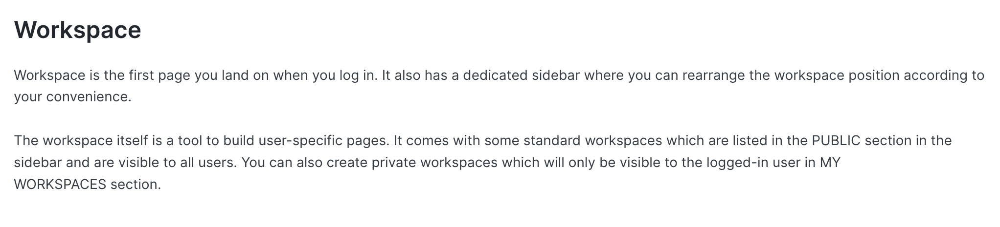

Both **Heading** and **Text** has an inline toolbar. Currently, we have limited tools like header size from H1 to H6, bold, italic and links. 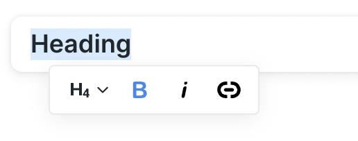

###Card A card contains several links that can be used for quick navigation. The link item can be a DocType, Report or Page. 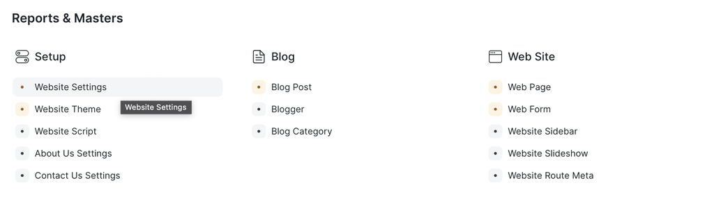

###Chart You can add any **Dashboard Chart** on the workspace using this block. 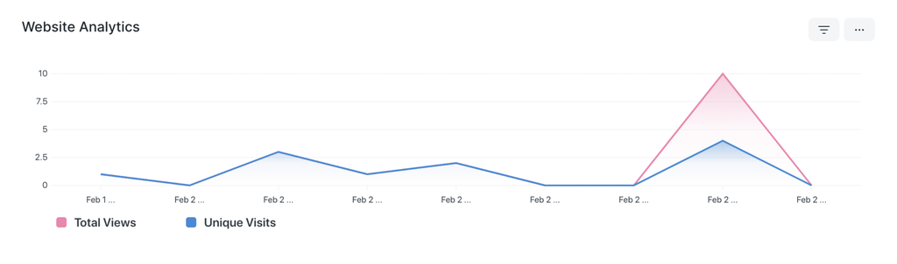 ###Shortcut Shortcut block is used to quickly navigate to any DocType, Report or Page.  Shortcuts can be customized too. You can select the view in which it should open, and can add filters that will be applied when you open the selected view. You can see the number of records based on the filters applied on the shortcut as a pill. 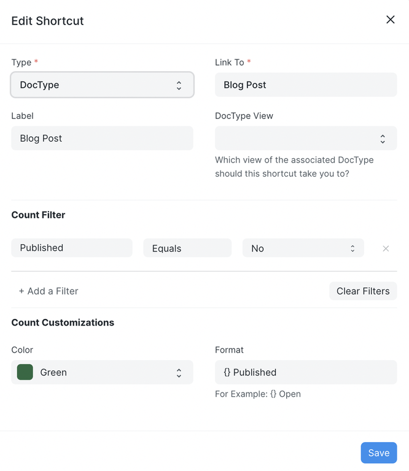 ###Spacer It is used to add some space between two blocks. 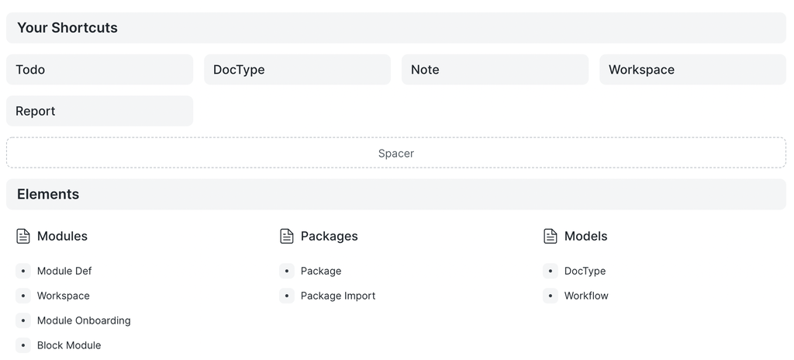 It can also be used to position other blocks by adding white space before or after the block. 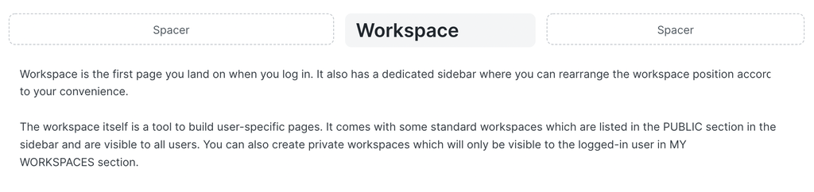 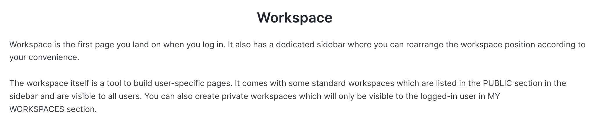 ###Onboarding The onboarding block is used to guide first-time users when they land on your page. It has steps to follow to learn a specific module. For each step, there is some description on the right section or there can be a link to a video. 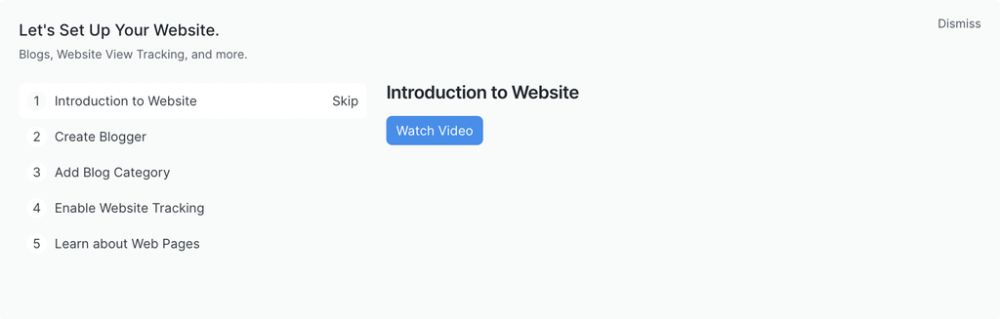 ###Quick List In the quick list block, we can see recently updated records of selected doctype. We can also add some filters. While in the read-only mode we have the option to refresh the list, update the applied filters, create a new record and open doctype's list view. 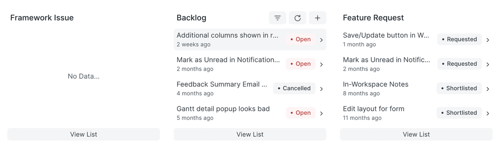 ###Number Card You can add any existing **Number Card** on the workspace using this block. 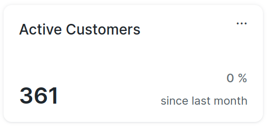

[ Previous Page Customization ](customization.md) [ Next Page Access ](access.md)

Last updated 2 months ago 

Was this helpful?
