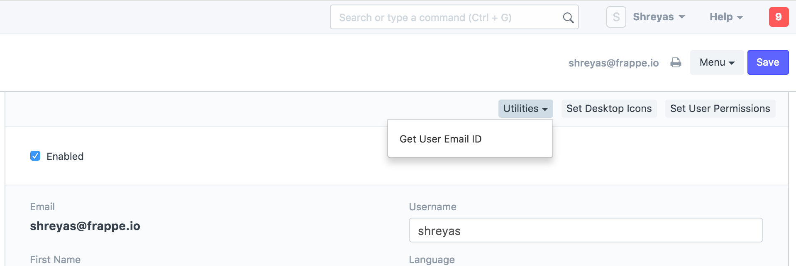

# Adding Custom Button To Form

[ Edit ](https://docs.frappe.io/wiki/spaces/r3uvq1ch61/page/128mmc3gfh)

Open in ChatGPT  Ask ChatGPT about this page Open in Claude  Ask Claude about this page

# Adding Custom Button To Form 

[ Edit ](https://docs.frappe.io/wiki/spaces/r3uvq1ch61/page/128mmc3gfh)

Open in ChatGPT  Ask ChatGPT about this page Open in Claude  Ask Claude about this page

To create a custom button on your form, you need to edit the javascript file associated to your doctype. For example, If you want to add a custom button to User form then you must edit `user.js`.

In this file, you need to write a new method `add_custom_button` which should add a button to your form.

#### Function Signature for `add_custom_button(...)`

frm.add_custom_button(__(buttonName), function(){ //perform desired action such as routing to new form or fetching etc. }, __(groupName));

#### Example-1: Adding a button to User form

We should edit `frappe\core\doctype\user\user.js`

frappe.ui.form.on('User', { refresh: function(frm) { ... frm.add_custom_button(__('Get User Email Address'), function(){ frappe.msgprint(frm.doc.email); }, __("Utilities")); ... } });

You should be seeing a button on user form as shown below,

[ Previous Page Running Background Jobs  ](running-background-jobs.md) [ Next Page Trigger Event On Deletion Of Grid Row  ](trigger-event-on-deletion-of-grid-row.md)

Last updated 2 months ago 

Was this helpful?
