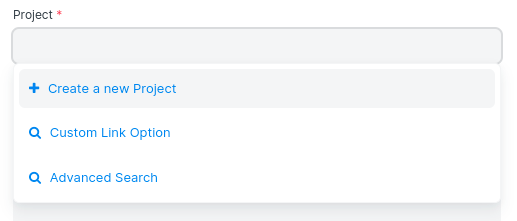

# Custom Action in Link Field

[ Edit ](https://docs.frappe.io/wiki/spaces/r3uvq1ch61/page/12804hhv1b)

Open in ChatGPT  Ask ChatGPT about this page Open in Claude  Ask Claude about this page

# Custom Action in Link Field

[ Edit ](https://docs.frappe.io/wiki/spaces/r3uvq1ch61/page/12804hhv1b)

Open in ChatGPT  Ask ChatGPT about this page Open in Claude  Ask Claude about this page

You can add a new custom link option to the standard link field by defining the function in the namespace `frappe.ui.form.ControlLink.link_options`.

In the `frappe.ui.form.ControlLink.link_options`, you have access to the link field object.

### 1\. Adding Custom Option
[code] 
    frappe.ui.form.ControlLink.link_options = function(link) {
     return [
     {
     html: ""
     + " "
     + __("Custom Link Option")
     + "",
     label: __("Custom Link Option"),
     value: "custom__link_option",
     action: () => {}
     }
     ];
    }
     
    
[/code]

Once a function is assigned to `frappe.ui.form.ControlLink.link_options`, the link field will have a new link option:

[ Previous Page Translations  ](../basics/translations.md) [ Next Page Executing Code On Doctype Events  ](executing-code-on-doctype-events.md)

Last updated 2 months ago 

Was this helpful?
