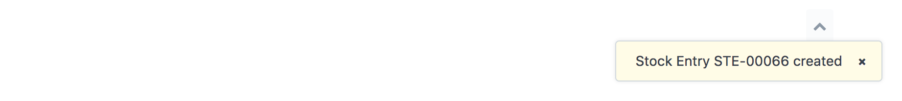
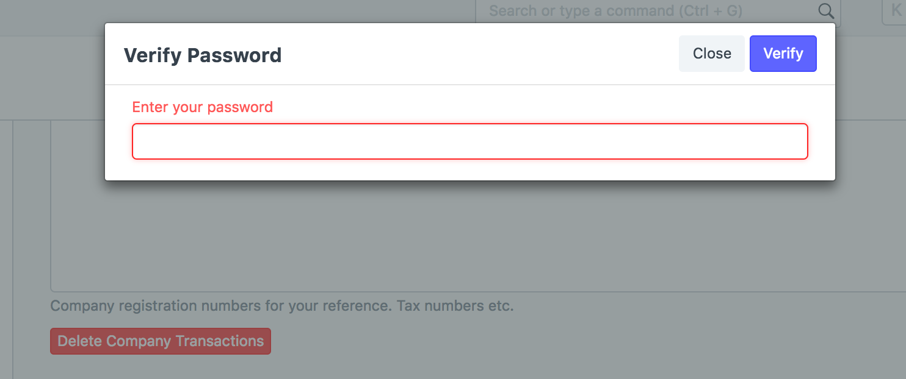
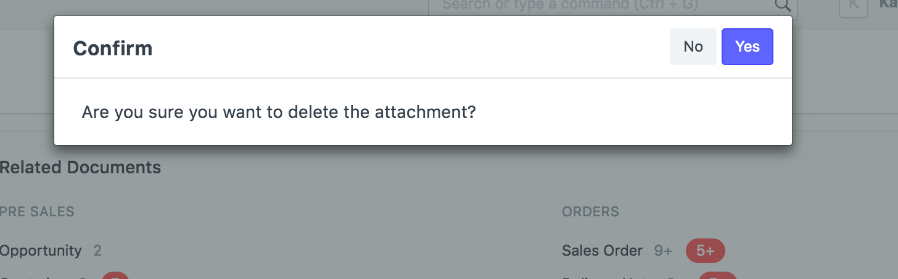
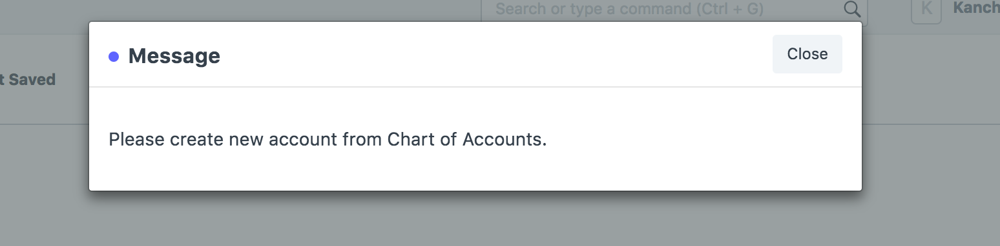
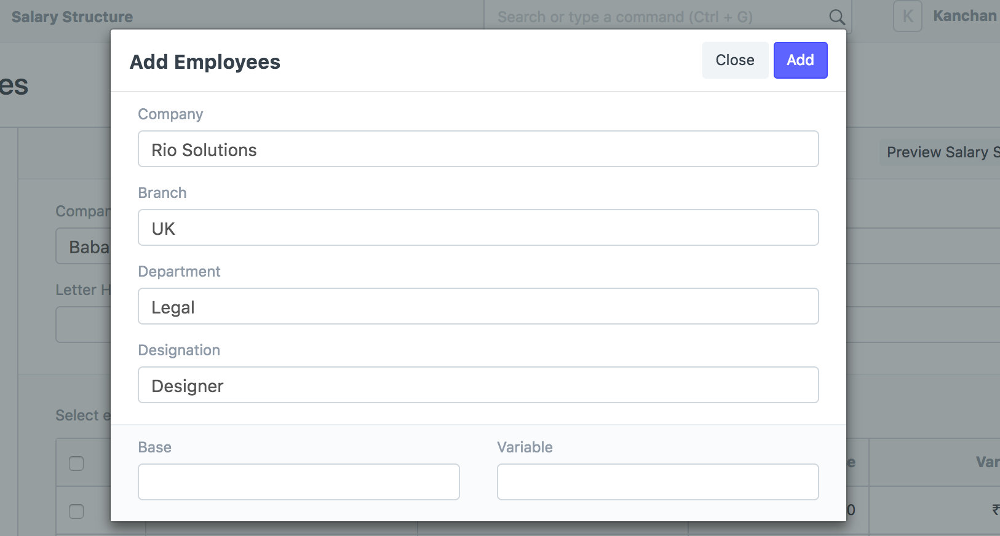

# Dialogs Types

[ Edit ](https://docs.frappe.io/wiki/spaces/r3uvq1ch61/page/129aoot3ll)

Open in ChatGPT  Ask ChatGPT about this page Open in Claude  Ask Claude about this page

# Dialogs Types 

[ Edit ](https://docs.frappe.io/wiki/spaces/r3uvq1ch61/page/129aoot3ll)

Open in ChatGPT  Ask ChatGPT about this page Open in Claude  Ask Claude about this page

Frappe provides a group of standard dialogs that are very useful while coding.

## Alert Dialog

Alert Dialog is used for showing non-obstructive messages.

It has 2 parameters:

  * **txt:** The message to be shown in the `Alert Dialog`
  * **seconds:** The duration that the message will be displayed. The default is `3 seconds`.

### Example

show_alert('Hi, do you have a new message', 5);

* * *

## Prompt Dialog

Prompt Dialog is used for collecting data from users.

It has 4 parameters:

  * **fields:** a list with the fields objects
  * **callback:** a function to process the data in the dialog
  * **title:** the title of the dialog
  * **primary_label:** the label of the primary button

### Example

frappe.prompt([ {'fieldname': 'birth', 'fieldtype': 'Date', 'label': 'Birth Date', 'reqd': 1} ], function(values){ show_alert(values, 5); }, 'Age verification', 'Subscribe me' )

* * *

## Confirm Dialog

Confirm Dialog is used to get a confirmation from the user before executing an action.

It has 3 arguments:

  * **mesage:** The message to display in the dialog
  * **onyes:** The callback on positive confirmation
  * **oncancel:** The callback on negative confirmation

### Example

frappe.confirm( 'Are you sure to leave this page?', function(){ window.close(); }, function(){ show_alert('Thanks for continue here!') } )

* * *

## Message Print

Message Print is used for showing information to users.

It has 2 arguments:

  * **message:** The message to display. It can be a HTML string
  * **title:** The title of the dialog

### Example

msgprint("**Server Status** "

  * "

* * *

"

  * ""
  * "* **28%** Memory "
  * "* **12%** Processor "
  * "* **0.3%** Disk "
  * " ", 'Server Info')

* * *

### Custom Dialog

You can extend and build your own custom dialogs using `frappe.ui.Dialog`

### Example

var d = new frappe.ui.Dialog({ 'fields': [ {'fieldname': 'ht', 'fieldtype': 'HTML'}, {'fieldname': 'today', 'fieldtype': 'Date', 'default': frappe.datetime.nowdate()} ], primary_action: function(){ d.hide(); show_alert(d.get_values()); } }); d.fields_dict.ht.$wrapper.html('Hello World'); d.show();

[ Previous Page Trigger Event On Deletion Of Grid Row  ](trigger-event-on-deletion-of-grid-row.md) [ Next Page Overriding Link Query By Custom Script  ](overriding-link-query-by-custom-script.md)

Last updated 2 months ago 

Was this helpful?
