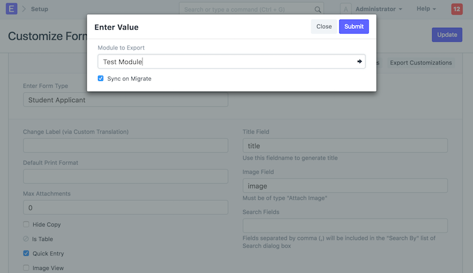
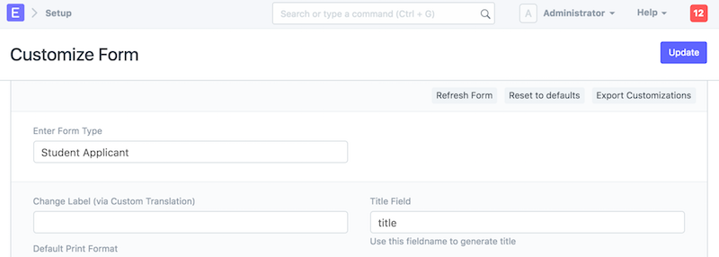

# Exporting Customizations to your App

[ Edit ](https://docs.frappe.io/wiki/spaces/r3uvq1ch61/page/12a45822dp)

Open in ChatGPT  Ask ChatGPT about this page Open in Claude  Ask Claude about this page

# Exporting Customizations to your App 

[ Edit ](https://docs.frappe.io/wiki/spaces/r3uvq1ch61/page/12a45822dp)

Open in ChatGPT  Ask ChatGPT about this page Open in Claude  Ask Claude about this page

A common use case is to extend a DocType via Custom Fields and Property Setters for a particular app. To save these settings to an app, go to **Customize Form**

You will see a button for **Export Customizations**

Here you can select the module and whether you want these particular customizations to be synced after every update.

The customizations will be exported to a new folder `custom` in the module folder of your app. The customizations will be saved by the name of the DocType

When you do `bench update` or `bench migrate` these customizations will be synced to the app.

[ Previous Page Adding Social Login Provider  ](adding-social-login-provider.md) [ Next Page Caching ](../caching.md)

Last updated 2 months ago 

Was this helpful?
