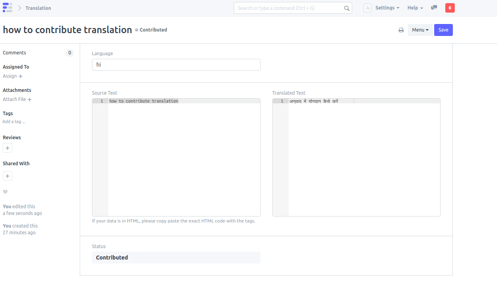
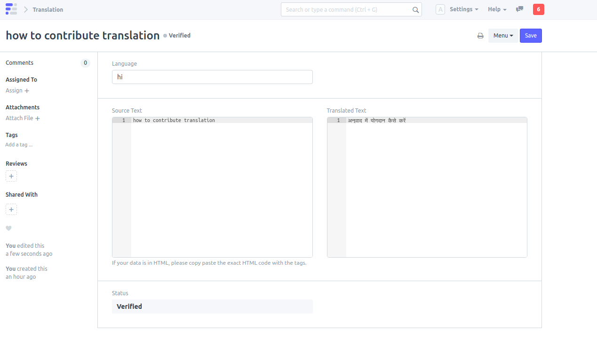
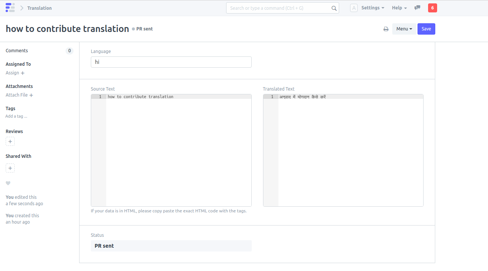
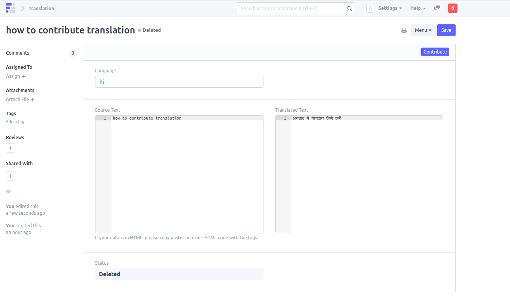

# Contribute Translations

[ Edit ](https://docs.frappe.io/wiki/spaces/r3uvq1ch61/page/127euikg1k)

Open in ChatGPT  Ask ChatGPT about this page Open in Claude  Ask Claude about this page

# Contribute Translations 

[ Edit ](https://docs.frappe.io/wiki/spaces/r3uvq1ch61/page/127euikg1k)

Open in ChatGPT  Ask ChatGPT about this page Open in Claude  Ask Claude about this page

This document shows how to **Contribute Translations** directly from your frappe app to translate.erpnext.com.

### 1\. Create a new translation record

  * Go to **Translation** doctype and click on New.
  * Enter the **language** , the **source text** and the **translated text** that you want to contribute and click on save.
  * After saving, a **contribute** button appears on the top right and a **Status** field appears on the button displaying the current status of the record. 

### 2\. Contribute Translation

  * Click on the **Contribute** button. A new record with your contributed details will be created on translate.erpnext.com.
  * The status field on the bottom will now display the status as **Contributed**. 

### 3\. Status of the Contributed Translation

  * After contributing the translation to translate.erpnext.com, a member of the Frappe team/community will validate the contributed translation stored at translate.erpnext.com and set the status as **Verified** if the translation is **correct**.

  * The status field in the translation record of the user will reflect this change. 

  * The translator app installed at translate.erpnext.com will then create a **Pull Request** containing all the **verified translations** that were contributed to translate.erpnext.com. The Translator app will automatically determine the app and the version of the app in which it has to send this PR.

  * When the PR is sent, the status field in the translation record of the user will now be set to **PR sent**. 

  * Similarly, if the Contributed translation is **not correct** , the member of the Frappe team/community can **delete** the record of the Contributed Translation from translate.erpnext.com.

  * The status field in the translation record of the user will now be set to **Deleted**. The user can make the necessary changes and again contribute this translation. 

See all the **Contributed Translations** from the Frappe community at [translate.erpnext.com](https://translate.erpnext.com/).

### 4\. Become a Verifier for Contributed Translations

  * If you want to become a **part of the community** and **verify** the translations contributed by other members of the community, sign-up on [translate.erpnext.com](https://translate.erpnext.com/).
  * The verifiers can then set the **status** of the contributed translations to **Verified** if the translations are correct. The translator app after a period of **every 15 days** , will take these verified contributed translations and send **Pull Requests** to respective Frappe repositories.

[ Previous Page Frappe Apps  ](apps.md) [ Next Page Frappe Ajax Call  ](frappe_ajax_call.md)

Last updated 2 months ago 

Was this helpful?
