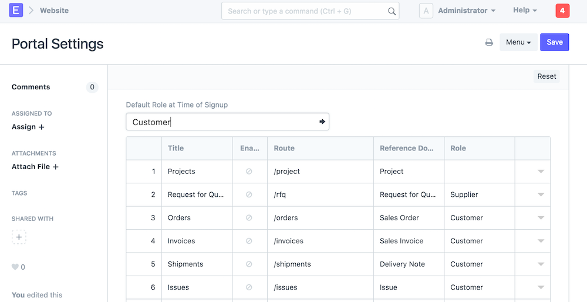

# Portal Roles

[ Edit ](https://docs.frappe.io/wiki/spaces/r3uvq1ch61/page/12d9fnmqui)

Open in ChatGPT  Ask ChatGPT about this page Open in Claude  Ask Claude about this page

# Portal Roles 

[ Edit ](https://docs.frappe.io/wiki/spaces/r3uvq1ch61/page/12d9fnmqui)

Open in ChatGPT  Ask ChatGPT about this page Open in Claude  Ask Claude about this page

Version: 7.1+

Roles can be assigned to Website Users and they will see menu based on their role

  1. A default role can be set in **Portal Settings**
  2. Each Portal Menu Item can have a role associated with it. If that role is set, then only those users having that role can see that menu item
  3. Rules can be set for default roles that will be set on default users on hooks

#### Rules for Default Role

For example if the Email Address matches with a contact id, then set role Customer or Supplier:

default_roles = [ {'role': 'Customer', 'doctype':'Contact', 'email_field': 'email_id', 'filters': {'ifnull(customer, "")': ('!=', '')}}, {'role': 'Supplier', 'doctype':'Contact', 'email_field': 'email_id', 'filters': {'ifnull(supplier, "")': ('!=', '')}}, {'role': 'Student', 'doctype':'Student', 'email_field': 'student_email_id'} ]

[ Previous Page Dynamic Pages  ](context.md) [ Next Page Customizing Web Forms  ](web-forms.md)

Last updated 2 months ago 

Was this helpful?
