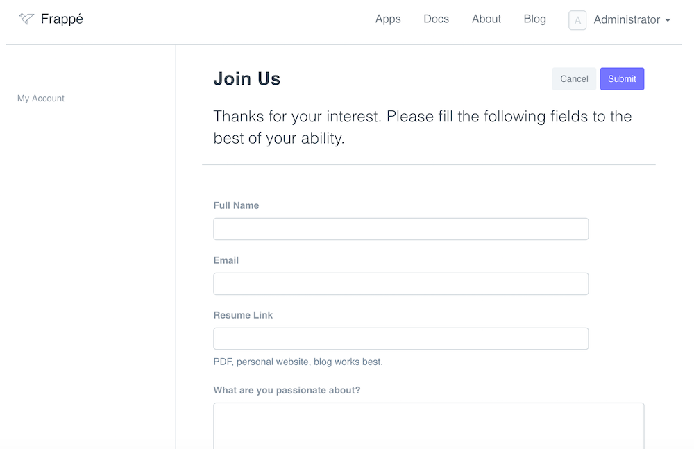

# Customizing Web Forms

[ Edit ](https://docs.frappe.io/wiki/spaces/r3uvq1ch61/page/12d6jm9s4e)

Open in ChatGPT  Ask ChatGPT about this page Open in Claude  Ask Claude about this page

# Customizing Web Forms 

[ Edit ](https://docs.frappe.io/wiki/spaces/r3uvq1ch61/page/12d6jm9s4e)

Open in ChatGPT  Ask ChatGPT about this page Open in Claude  Ask Claude about this page

Web Forms are a powerful way to add forms to your website. Web forms are powerful and scriptable and from Version 7.1+ they also include tables, paging and other utilities

### Standard Web Forms

If you check on the "Is Standard" checkbox, a new folder will be created in the `module` of the Web Form for that web form. In this folder, you will see a `.py` and `.js` file that you can customize the web form with.

### Web Form Settings

  * **Allow Edit** : Allow each user to have one instance and edit it
  * **Allow Multiple** : Allow users to view and edit multiple instances of the web form
  * **Show as Grid** : Show table view of the web form values (only if "Allow Multiple" is set)
  * **Allow Incomplete Forms** : For very long forms, you can allow the user to save without throwing validation for mandatory. The user will still see the fields as manadatory.

### Client Script

You can also add a custom client script to the web form

## API

##### Event Handler

Write an event handler to do actions when a field is changed.
[code] 
    frappe.web_form.on([fieldname], [handler]);
    
[/code]

##### Get Value

Get value of a particular field
[code] 
    value = frappe.web_form.get_value([fieldname]);
    
[/code]

##### Set Value

Set value of a particular field
[code] 
    frappe.web_form.set_value([fieldname], [value])
    
[/code]

##### Validate

`frappe.web_form.validate` is called before the web_form is saved. Add custom validation by overriding the `validate` method. To stop the user from saving, return `false`;
[code] 
    frappe.web_form.validate = () => {
     // return false if not valid
    }
    
[/code]

##### Set Field Property
[code] 
    frappe.web_form.set_df_property([fieldname], [property], [value]);
    
[/code]

##### Trigger script when form is loaded

Initialize form with customisation after it is loaded
[code] 
    frappe.web_form.after_load = () {
     // init script here
    }
    
[/code]

## Examples

##### Reset value if invalid
[code] 
    frappe.web_form.on('amount', (field, value) => {
     if (value < 1000) {
     frappe.msgprint('Value must be more than 1000');
     field.set_value(0);
     }
    });
    
[/code]

##### Custom Validation
[code] 
    frappe.web_form.validate = () => {
     let data = frappe.web_form.get_values();
     if (data.amount < 1000) {
     frappe.msgprint('Value must be more than 1000');
     return false;
     }
    });
    
[/code]

##### Hide a field based on value
[code] 
    frappe.web_form.on('amount', (field, value) => {
     if (value < 1000) {
     frappe.web_form.set_df_property('rate', 'hidden', 1);
     }
    });
    
[/code]

##### Show a message on startup
[code] 
    frappe.web_form.after_load = () => {
     frappe.msgprint('Please fill all values carefully');
    }
    
[/code]

### Breadcrumbs

You can customize the breadcrumbs in a Web Form by adding JSON object.

Example:
[code] 
    [{"label": "Home", "route":"/" }]
    
[/code]

[ Previous Page Portal Roles  ](portal-roles.md) [ Next Page Generators  ](generators.md)

Last updated 2 months ago 

Was this helpful?
