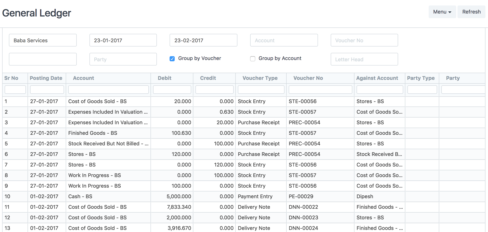

# Report Print Formats

[ Edit ](https://docs.frappe.io/wiki/spaces/r3uvq1ch61/page/12cqomdbp6)

Open in ChatGPT  Ask ChatGPT about this page Open in Claude  Ask Claude about this page

# Report Print Formats 

[ Edit ](https://docs.frappe.io/wiki/spaces/r3uvq1ch61/page/12cqomdbp6)

Open in ChatGPT  Ask ChatGPT about this page Open in Claude  Ask Claude about this page

In version 4.1 we introduce Report Print Formats. These are HTML templates that you can use to format Query Report data for printing.

### 1\. Creating New Print Formats

To create a new Print Format, just drop in a `.html` file in the folder of the query report. For example, for the [General Ledger](https://github.com/frappe/erpnext/tree/develop/erpnext/accounts/report/general_ledger) report in ERPNext, you can drop in a file called `general_ledger.html` along side the `.js` and `.py` files.

##### Tree Of `erpnext/accounts/general_ledger`

general_ledger/ ├── __init__.py ├── general_ledger.html ├── general_ledger.js ├── general_ledger.json └── general_ledger.py

### 2\. Templating

For templating, we use an adapted version of [John Resig's microtemplating script](http://ejohn.org/blog/javascript-micro-templating/). If you know Javascript, it is very easy to follow this templating language.

##### Here are some examples (from John Resig's Blog):

Example: Properities:

">

**[<%=from_user%>](https://docs.frappe.io/%3C%=from_user%%3E):** <%=text%>

Example: Code structures, Loops

<% for ( var i = 0; i < users.length; i++ ) { %>

  * [<%=users[i].name%>](<%=users%5Bi%5D.url%>)

<% } %>

> **Note** : It is important to note that you should not use single quotes (') in your template as the engine cannot handle them effectively.

### 3\. Data

Data is available to the template as:

  * `data`: this is a list of records, with each record as an object with slugified properties from labels. For example "Posting Date" becomes "posting_date"
  * `filters`: filters set in the report
  * `report`: reportview object

### 4\. Example

Here is how the General Ledger Report is built:

[General Ledger Print Format Template](https://github.com/frappe/erpnext/blob/develop/erpnext/accounts/report/general_ledger/general_ledger.html)

Here is what the report looks like:

##### Comments:

  1. [Bootstrap Stylesheet](http://getbootstrap.com/) is pre-loaded.
  2. You can use all global functions like `fmt_money` and dateutil.
  3. Translatable strings should be written as `__("text")`
  4. You can create modules and import using ``

[ Previous Page How To Make Query Report  ](how-to-make-query-report.md) [ Next Page Script Report  ](how-to-make-script-reports.md)

Last updated 2 months ago 

Was this helpful?
