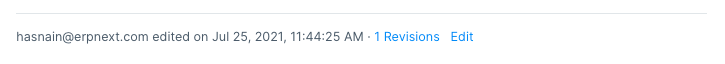
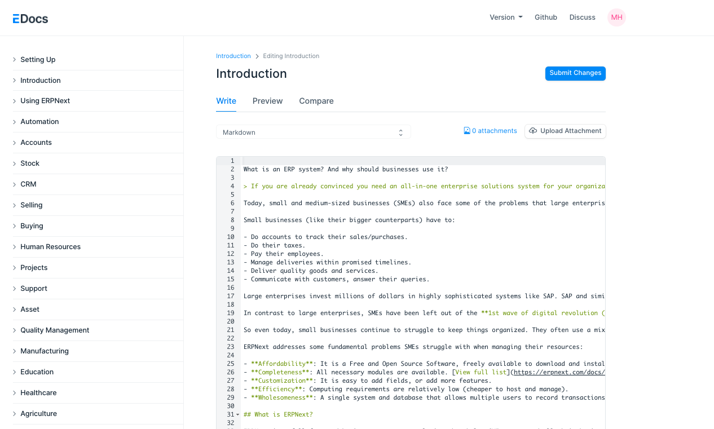
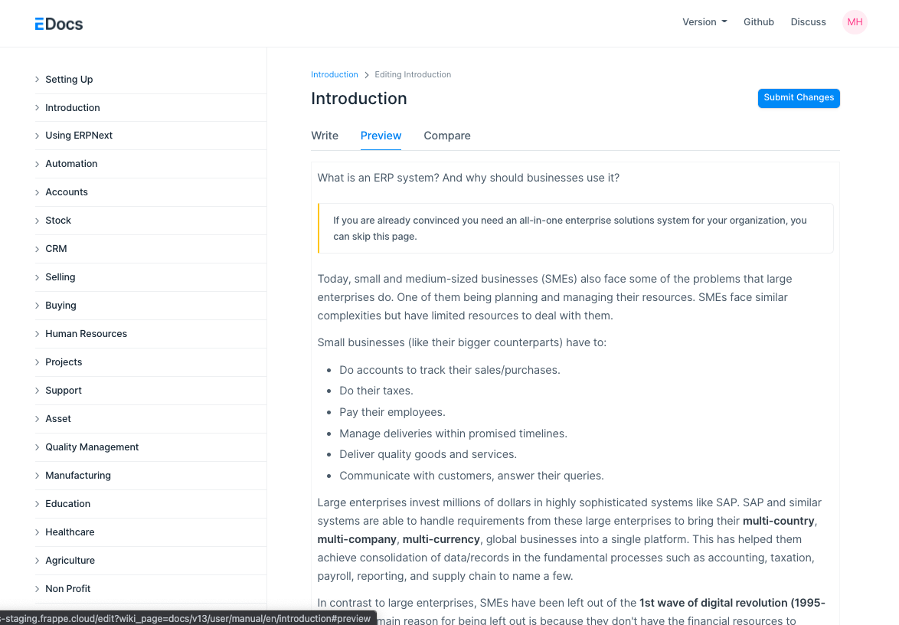
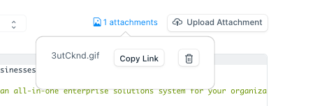
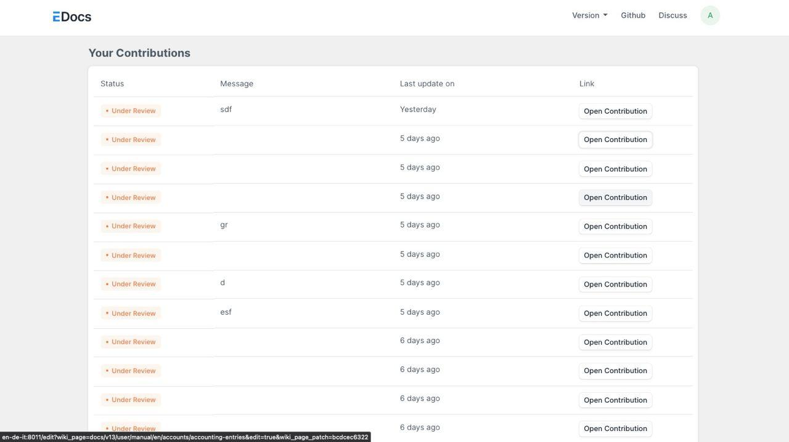
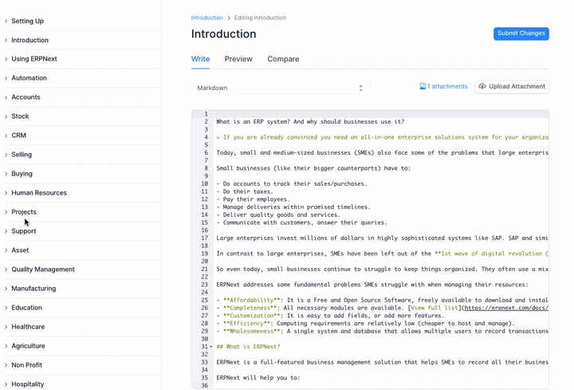

# How to contribute

[ Edit ](https://docs.frappe.io/wiki/spaces/r3uvq1ch61/page/136746v9b9)

Open in ChatGPT  Ask ChatGPT about this page Open in Claude  Ask Claude about this page

# How to contribute

[ Edit ](https://docs.frappe.io/wiki/spaces/r3uvq1ch61/page/136746v9b9)

Open in ChatGPT  Ask ChatGPT about this page Open in Claude  Ask Claude about this page

All Pages on the documentation website are stored in the database and can be edited whenever needed.

Broadly the steps to make a change to the documentation is as follows

  1. Go to the page on which you want to make changes
  2. At the bottom of the page you will find the `edit` button
  3. On clicking the Edit button you should see a UI like this
  4. Now you can edit the markdown code and check the preview on the `Preview Tab`
  5. If you do not want to edit markdown and want to edit via the WYSIWYG Editor click on the switcher and choose Rich-Text 
  6. For uploading images:
  7. In Markdown mode
  8. Click on add attachment button to upload an image
  9. Use the copy link button to get the link copied
  10. Then paste the link in the editor to display the image
  11. In WYSIWYG editor:
  12. You can either paste a copied image
  13. Drag and drop an image
  14. Use the image button on top of the editor
  15. After editing the file click on the Submit button and wait for your change to get submitted
  16. Once submitted you will see this screen
  17. On this screen you can track all your contributions and wait for a reviewer to review your changes and either approve, reject or request changes
  18. You can click on open contribution to continue your work or use the comment system to communicate with the reviewer
  19. If you want to create a new page instead of editing a page you will find the New Page link at the bottom of the Left Sidebar, the process then is similar to editing
  20. You can also drag and drop sidebars on the edit/ new page to rearrange them(Use this only when necessary)

Hoping to see lots of contributions!

[ Previous Page Debugging  ](debugging.md) [ Next Page Profiling and Monitoring ](profiling.md)

Last updated 2 months ago 

Was this helpful?
