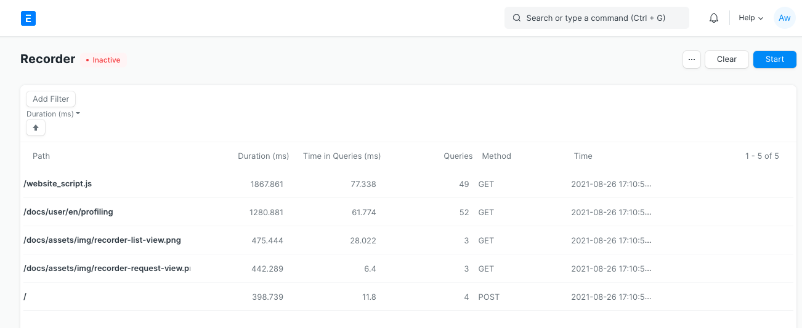
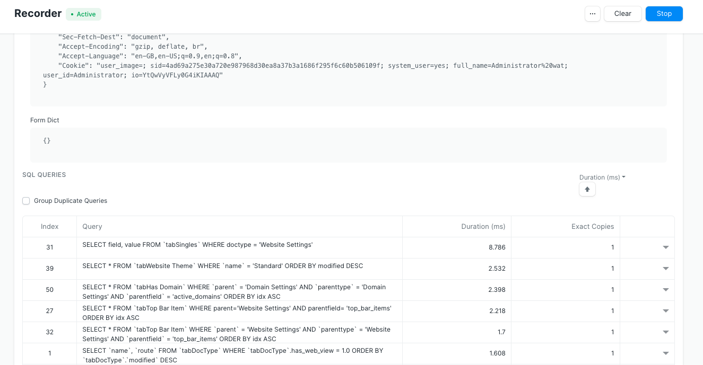

# Profiling and Monitoring

[ Edit ](https://docs.frappe.io/wiki/spaces/r3uvq1ch61/page/1365biee2i)

Open in ChatGPT  Ask ChatGPT about this page Open in Claude  Ask Claude about this page

# Profiling and Monitoring

[ Edit ](https://docs.frappe.io/wiki/spaces/r3uvq1ch61/page/1365biee2i)

Open in ChatGPT  Ask ChatGPT about this page Open in Claude  Ask Claude about this page

## Recorder - SQL profiler

Frappe Recorder is a profiling tool built into the Frappe framework designed to capture all requests, SQL queries executed along with stack traces.

Example use case: You've noticed that a certain doctype is taking too much time to save and you believe that SQL queries might be a bottleneck. In such a case starting recorder and then submitting your document will give you complete capture of all the queries that took place.

  1. Open Recorder from Awesomebar and click on "Start recording".
  2. Perform the actions you want to profile (preferably in another tab.)
  3. Once you've captured enough information, go to the recorder again and stop recording.

You will now see a list of all the requests that were made. You can sort them by various columns to identify problematic requests.

Click on a row to open the request for extra information. Following information is available in capture:

  1. path - requested path e.g. `/app`
  2. cmd - dotted path to the method
  3. time - time at which request was created
  4. duration - duration for completing the request (see implementation note below)
  5. number of queries - Number of SQL queries executed for fulfilling the request.
  6. Time in queries - Time taken in SQL queries.
  7. Request headers - HTTP headers received with the request.
  8. Form Dict - form data received with the request.
  9. SQL queries - table of all SQL queries that ran.

SQL Queries table can be sorted and grouped for duplicates to find the relevant queries. To know more about a particular query click on row to expand additional information. This includes the duration of the query, stack trace and SQL's `EXPLAIN` output for that query.

> Implementation note: Recorder adds sizable overhead for capturing the details, hence overall duration is not representative of real-world performance. Query time however is very close to real-world performance.

### Exporting Frappe Recorder captures

You can export recorder captures and import them on another site for further analysis.

  1. Go to recorder page. Once you've recorded click on Menu (three dots) > Export Data.
  2. This will download a JSON file containing captured data. To view this on another site drag and drop the JSON file on the recorder page.

## Profiling functions using bench

Bench's `execute` command runs a dotted path to method and it also supports profiling.
[code] 
    ▶ bench --site [sitename] --profile execute erpnext.projects.doctype.task.task.set_tasks_as_overdue
    
[/code]

You should be able to run most commands you can run via console with `execute` now, including _db_ methods.
[code] 
    ▶ bench --site [sitename] execute frappe.db.get_database_size
    6784
    
[/code]

## Frappe Monitor

Monitor logs request and job metadata. To enable this feature set `"monitor": 1` in your site config.

Collected data is buffered in redis cache and periodically moved to `monitor.json.log` file in `logs` directory with a scheduled job `frappe.monitor.flush`.
[code] 
    {
     "duration": 807142,
     "request": {
     "ip": "127.0.0.1",
     "method": "GET",
     "path": "/api/method/frappe.realtime.get_user_info",
     "response_length": 9687,
     "status_code": 500
     },
     "site": "frappe.local",
     "timestamp": "2020-03-05 09:37:17.397884",
     "transaction_type": "request",
     "uuid": "83be6a4c-27a1-497a-9ce6-c815bca4e420"
    }
    
[/code]
[code] 
    {
     "duration": 1364,
     "job": {
     "method": "frappe.ping",
     "scheduled": false,
     "wait": 90204
     },
     "site": "frappe.local",
     "timestamp": "2020-03-05 09:37:40.124682",
     "transaction_type": "job",
     "uuid": "8225ab76-8bee-462c-b9fc-a556406b1ee7"
    }
    
[/code]

## Background Jobs monitoring

Frappe uses RQ (Redis Queue) for asynchronously executing long tasks in background. You can monitor RQ using these inbuilt virtual doctypes:

### 1\. RQ Worker - Monitoring a background worker

RQ worker doctype shows all background workers consuming the background jobs queue on your site. It also contrains basic statistics about the worker like name, timing, successful and failed jobs count and currently status.

### 2\. RQ Job - Monitoring and controlling background jobs.

RQ Job is a virtual doctype which provides information about all background jobs. You can filter jobs by queue and status.

Form view of RQ job shows all information about the job.

[ Previous Page How to contribute ](how_to_contribute.md) [ Next Page Translations  ](translations.md)

Last updated 2 months ago 

Was this helpful?
