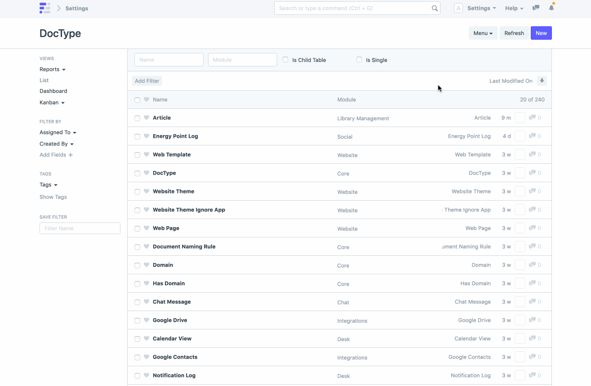

# Controller Methods

[ Edit ](https://docs.frappe.io/wiki/spaces/r3uvq1ch61/page/12627vlont)

Open in ChatGPT  Ask ChatGPT about this page Open in Claude  Ask Claude about this page

# Controller Methods 

[ Edit ](https://docs.frappe.io/wiki/spaces/r3uvq1ch61/page/12627vlont)

Open in ChatGPT  Ask ChatGPT about this page Open in Claude  Ask Claude about this page

Controller methods allow you to write business logic during the lifecycle of a document.

Let's create our second doctype: **Library Member**. It will have the following fields:

  1. First Name (Data, Mandatory)
  2. Last Name (Data)
  3. Full Name (Data, Read Only)
  4. Email Address (Data)
  5. Phone (Data)

After you have created the doctype, go to Library Member list, clear the cache from **Settings > Reload** and create a new Library Member.

If you notice, the Full Name field is not shown in the form. This is because we set it as Read Only. It will be shown only when it has some value.

Let's write code in our python controller class such that Full Name is computed automatically from First Name and Last Name.

Open your code editor and open the file `library_member.py` and make the following changes:

**library\\_member.py**
[code] 
    class LibraryMember(Document):
     #this method will run every time a document is saved
     def before_save(self):
     self.full_name = f'{self.first_name} {self.last_name or ""}'
    
    
[/code]

* * *

**NOTE**

If the above snippet doesn't work for you , make sure server side scripts are enabled, and then restart bench
[code] 
    bench --site  set-config server_script_enabled true
    
[/code]

* * *

We wrote the logic in the `before_save` method which runs every time a document is saved. This is one of the many hooks provided by the `Document` class. You can learn more about all the available hooks at [Controller](../basics/doctypes/controllers.md) docs.

Now, go back and create another Library Member and see the Full Name show up after save.

Next: [Types of DocType](types-of-doctype.md)

[ Previous Page DocType Features  ](doctype-features.md) [ Next Page Types of DocType  ](types-of-doctype.md)

Last updated 2 months ago 

Was this helpful?
