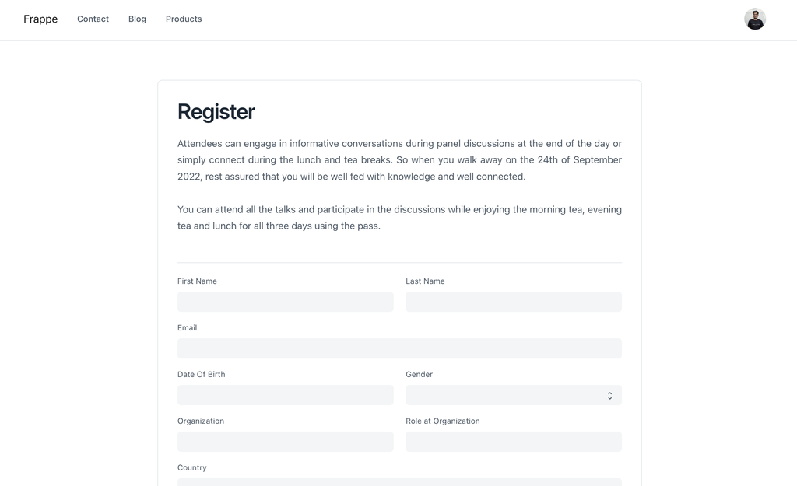
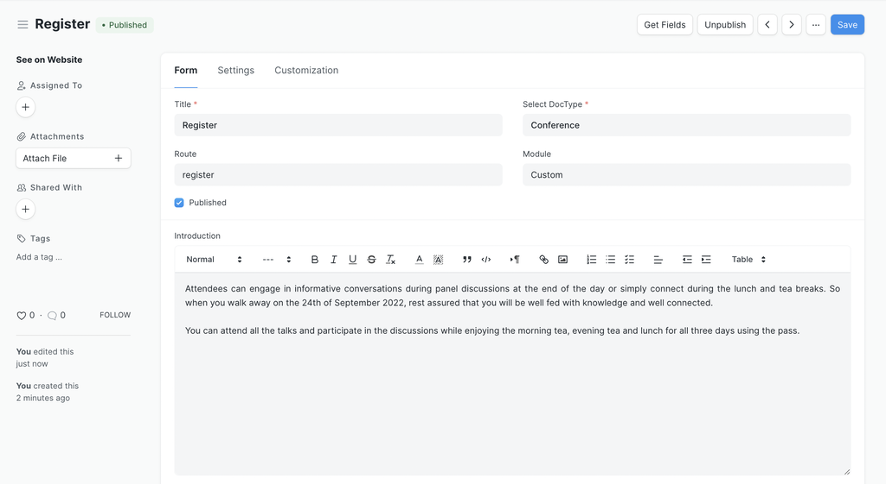
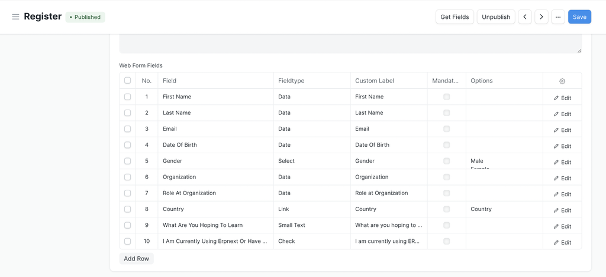

# Web Form

[ Edit ](https://docs.frappe.io/wiki/spaces/r3uvq1ch61/page/12pnkj75rp)

Open in ChatGPT  Ask ChatGPT about this page Open in Claude  Ask Claude about this page

# Web Form

[ Edit ](https://docs.frappe.io/wiki/spaces/r3uvq1ch61/page/12pnkj75rp)

Open in ChatGPT  Ask ChatGPT about this page Open in Claude  Ask Claude about this page

Frappe provides an easy way to generate forms for your website with very little configuration. These forms may be public (anyone can fill them up) or can be configured to require login.

## Creating a Web Form

To create a Web Form, type "new web form" in awesomebar and hit enter.

  1. Enter Title
  2. Select DocType for which the record should be created.
  3. Add some introduction (Optional).
  4. Click on "Get Fields" button to get all fields from selected doctype OR select fields for your web form.
  5. Publish it and you are good to go.

 

[Customize Web Form →](web-form/customization.md)

## Standard Web Forms

If you check the "Is Standard" checkbox, a new folder will be created in the `module` of the Web Form. In this folder, you will see a `.py` and `.js` file that you can use to configure the web form. These files need to be checked into version control with your custom app. You can install this app on any site and it will have this web form installed.

> `Is Standard` field will only be visible when you are in developer mode.

[ Previous Page Blog Post  ](blog-post.md) [ Next Page Settings ](web-form/settings.md)

Last updated 2 months ago 

Was this helpful?
