# Customization

[ Edit ](https://docs.frappe.io/wiki/spaces/r3uvq1ch61/page/12qnbs3apk)

Open in ChatGPT  Ask ChatGPT about this page Open in Claude  Ask Claude about this page

# Customization

[ Edit ](https://docs.frappe.io/wiki/spaces/r3uvq1ch61/page/12qnbs3apk)

Open in ChatGPT  Ask ChatGPT about this page Open in Claude  Ask Claude about this page

You can customize your webform to make it more unique and enable functionalities to meet your usecase.

## Fields Layout

You can add `Column Breaks` & `Section Breaks` in webform fields table to change the layout of the form fields. 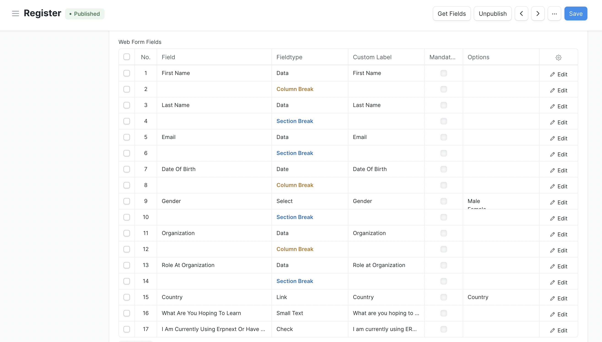 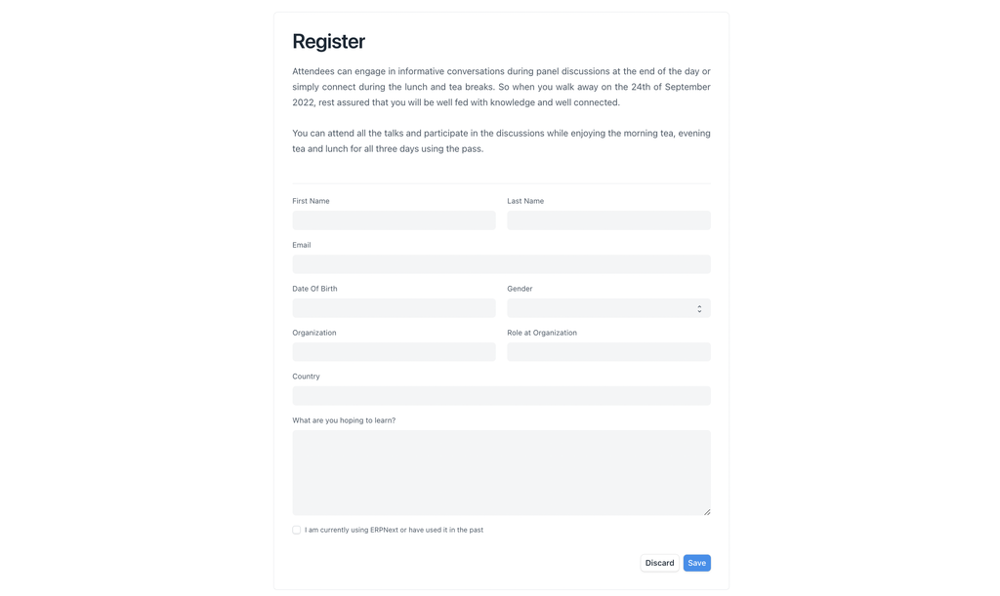

## Multi Step Webform

Updating the layout makes webform look better but still if webform has many fields it becomes lengthy. We can add `Page Breaks` to segregate the sections in different pages (called as Multi Step Webform).

> You can add maximum 9 Page Breaks which will only allow 10 Pages.

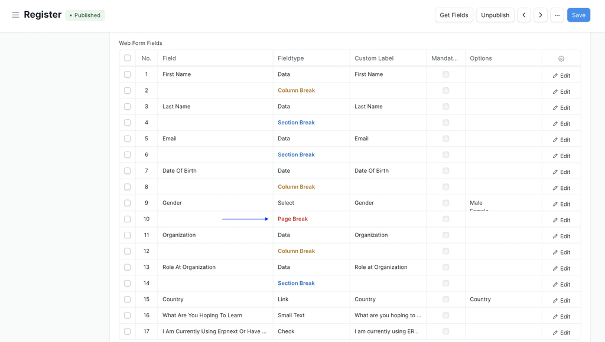 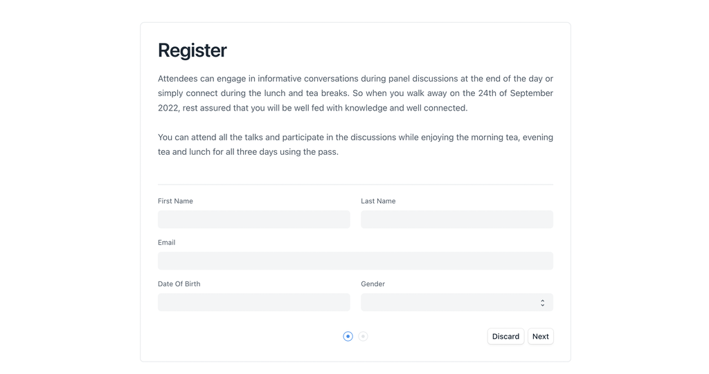 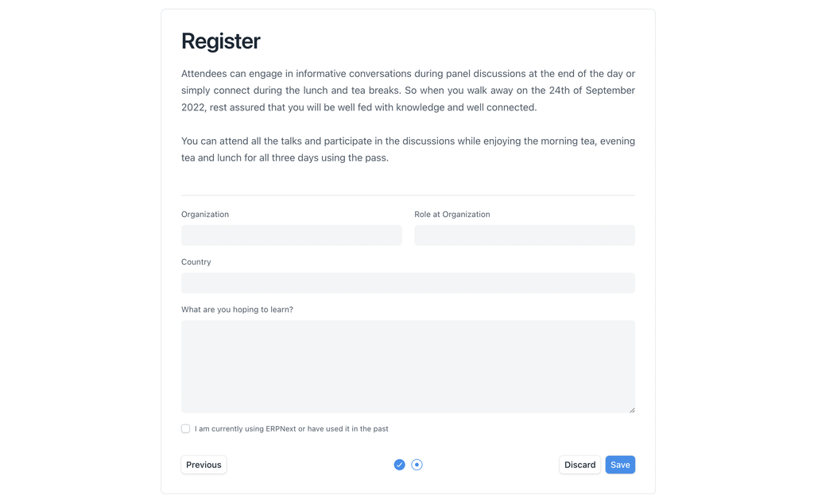

> All the customization options mentioned below can be done from the Customization Tab of webform document.

## Submit Button Label

You can change the label of submit button on the webform. 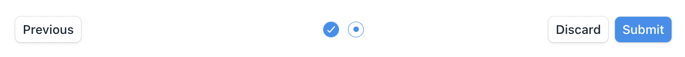

## Banner Image

You can now add banner image on webform. 

## Breadcrumbs

You can customize the breadcrumbs in a Web Form by adding JSON object.

> Breadcrumbs are only visible if the webform [`list view`](settings.md) is enabled.

Example: 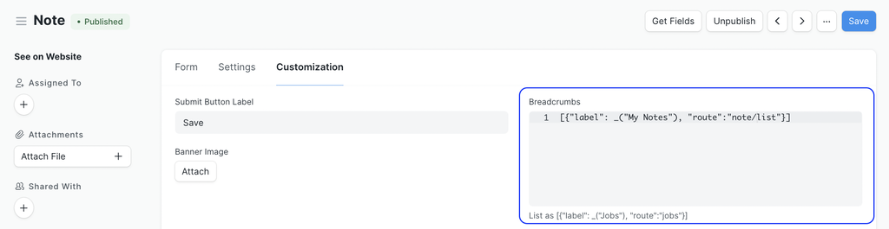 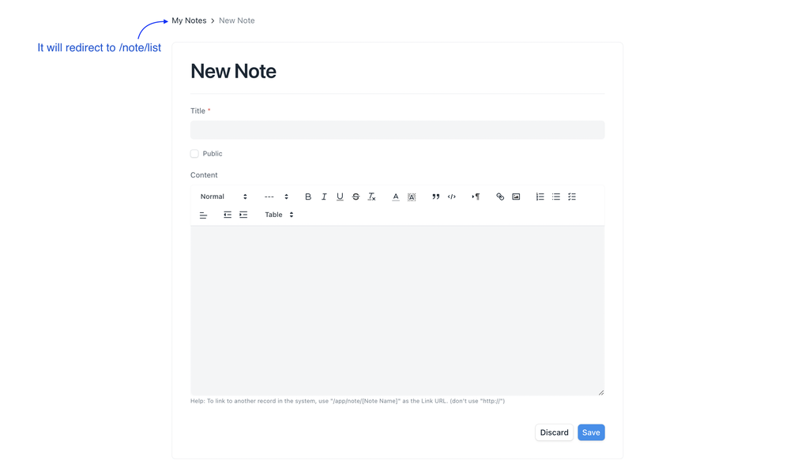

## After Submit Page

You can give custom success title and message which will appear after user has submitted the webform. 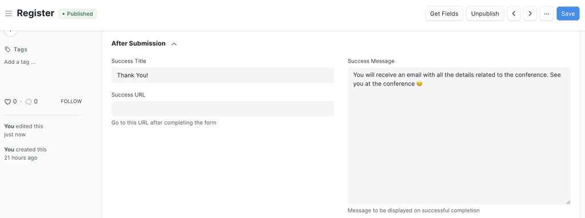 

Based on the access extra buttons will be visible on the submit page like

See previous responses

Edit your response

View your response &

Submit another response

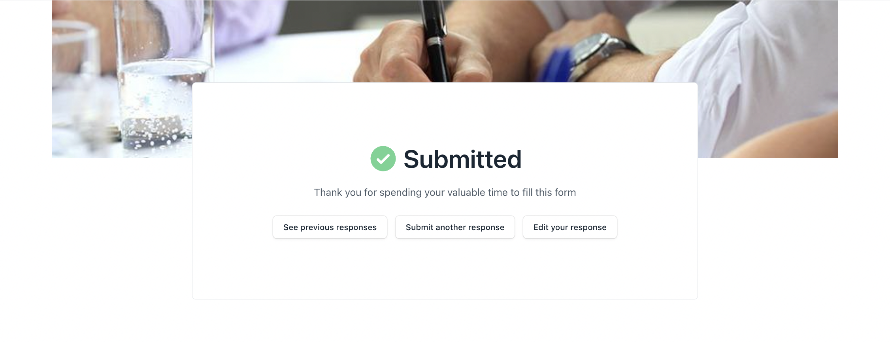

Configure your webform to redirect to a specific URL after 5 seconds after it has been submitted by setting `success_url` field. 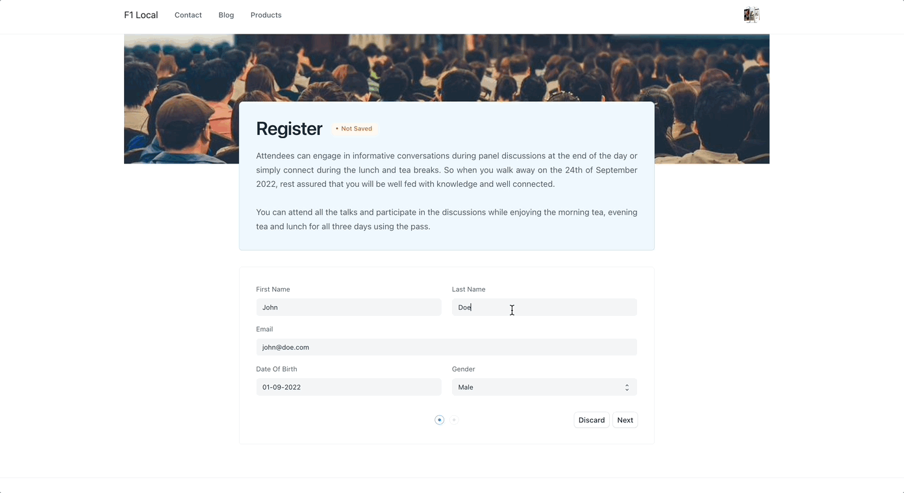

## Custom CSS

You can add custom css to change the look of the webform

Example:
[code] 
    .web-form-header {
     margin-bottom: 2rem;
     border: 1px solid var(--blue-200) !important;
     border-radius: var(--border-radius);
     background-color: var(--blue-50) !important;
    }
    
    .web-form-head {
     border: none !important;
     padding-bottom: 2rem !important;
    }
    
    .web-form {
     border: 1px solid var(--dark-border-color) !important;
     border-radius: var(--border-radius);
     padding-top: 2rem !important;
    }
    
[/code]

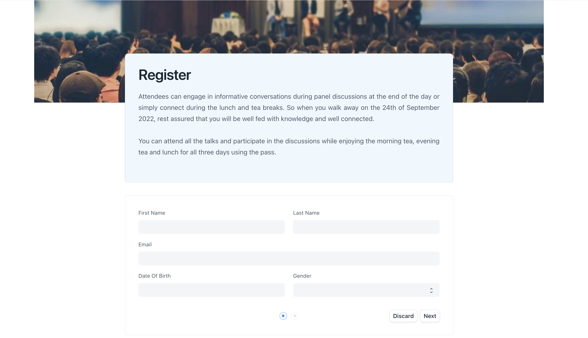

## Client Script

You can also add a custom client script to the web form

##### Event Handler

Write an event handler to do actions when a field is changed.
[code] 
    frappe.web_form.on([fieldname], [handler]);
    
[/code]

##### Get Value

Get value of a particular field
[code] 
    value = frappe.web_form.get_value([fieldname]);
    
[/code]

##### Set Value

Set value of a particular field
[code] 
    frappe.web_form.set_value([fieldname], [value])
    
[/code]

##### Validate

`frappe.web_form.validate` is called before the web_form is saved. Add custom validation by overriding the `validate` method. To stop the user from saving, return `false`;
[code] 
    frappe.web_form.validate = () => {
     // return false if not valid
    }
    
[/code]

##### Set Field Property
[code] 
    frappe.web_form.set_df_property([fieldname], [property], [value]);
    
[/code]

##### Trigger script when form is loaded

Initialize form with customisation after it is loaded
[code] 
    frappe.web_form.after_load = () => {
     // init script here
    }
    
[/code]

#### Examples

##### Reset value if invalid
[code] 
    frappe.web_form.on('amount', (field, value) => {
     if (value < 1000) {
     frappe.msgprint('Value must be more than 1000');
     field.set_value(0);
     }
    });
    
[/code]

##### Custom Validation
[code] 
    frappe.web_form.validate = () => {
     let data = frappe.web_form.get_values();
     if (data.amount < 1000) {
     frappe.msgprint('Value must be more than 1000');
     return false;
     }
    });
    
[/code]

##### Hide a field based on value
[code] 
    frappe.web_form.on('amount', (field, value) => {
     if (value < 1000) {
     frappe.web_form.set_df_property('rate', 'hidden', 1);
     }
    });
    
[/code]

##### Show a message on startup
[code] 
    frappe.web_form.after_load = () => {
     frappe.msgprint('Please fill all values carefully');
    }
    
[/code]

[ Previous Page Settings ](settings.md) [ Next Page Developer API  ](../api.md)

Last updated 2 months ago 

Was this helpful?
